# TP1 AspectJ - Gestion des transactions 😎

**Objectif** 

A la fin de cette section, tu seras capable d'implémenter un système sécurisé de gestion de transactions bancaires.

## QCM

!!! question "Questions"

    1- Qu'est ce que l'AOP et les méchanismes similaires à l'AOP ?

    2- Qu'est ce que le tissage dynamique et le tissage statique ?

    3- Rappel les concepts de base pour une AOP ?

<!-- 
Les concepts de base pour une AOP sont les suivants :
 - Tisseurs d'aspects statique et dynamique (Aspect Weaver)
 - JoinPoint
 - Poincut
 - Code Advice
 - Willwards
 - Mécanisme d'introduction
-->

## I- Création et exécution d'un aspect

Entrons dans le vif du sujet 🤓. Voici le diagramme de classe des principales classes du projet:


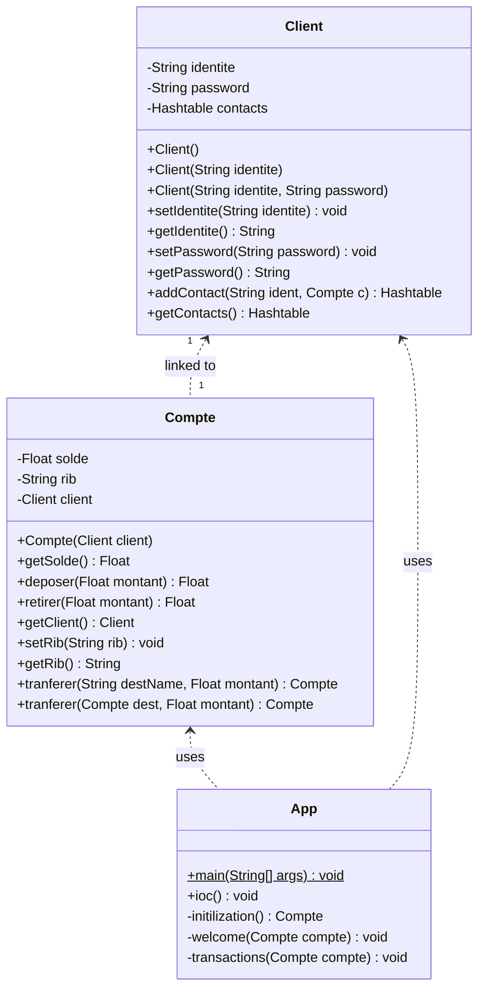
``` mermaid
classDiagram
  App : +main(String[] args)$ void
  App:  +ioc() void
  App:  -initilization() Compte
  App:  -welcome(Compte compte) void
  App:  -transactions(Compte compte) void

  Compte:  -Float solde
  Compte:  -String rib
  Compte:  -Client client
  Compte:  +Compte(Client client)
  Compte:  +getSolde() Float
  Compte : +deposer(Float montant) Float
  Compte : +retirer(Float montant) Float
  Compte:  +getClient() Client
  Compte:  +setRib(String rib) void
  Compte:  +getRib() String
  Compte : +tranferer(String destName, Float montant) Compte
  Compte : +tranferer(Compte dest, Float montant) Compte


  Client:  -String identite
  Client:  -String password
  Client:  -Hashtable contacts
  Client:  +Client()
  Client:  +Client(String identite)
  Client:  +Client(String identite, String password)
  Client:  +setIdentite(String identite) void
  Client:  +getIdentite() String
  Client:  +setPassword(String password) void
  Client:  +getPassword() String
  Client:  +addContact(String ident, Compte c) Hashtable
  Client:  +getContacts() Hashtable
  


  Compte <.. App: uses
  Client <.. App: uses
  Client "1" <.. "1" Compte:linked to

```

Par défaut, l'application est fournie avec un compte test: `anonym`.

👉 [[Récupérer le projet]](../../ressources/BeBank.zip)

Maintenant nous allons convertir notre projet en un projet AspectJ.

### Initialisation d'un projet AspectJ

Faites un clic droit sur le dossier d'un simple projet et procéder comme suit:

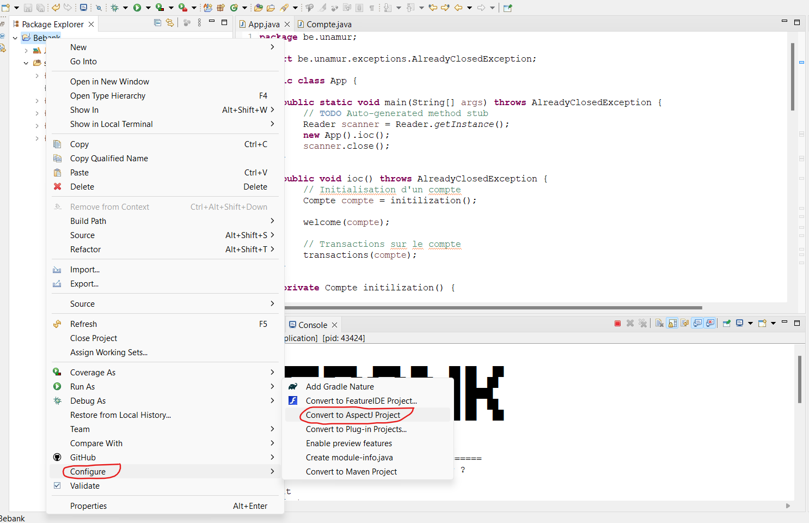

Et après vous avez dans l'Explorer:

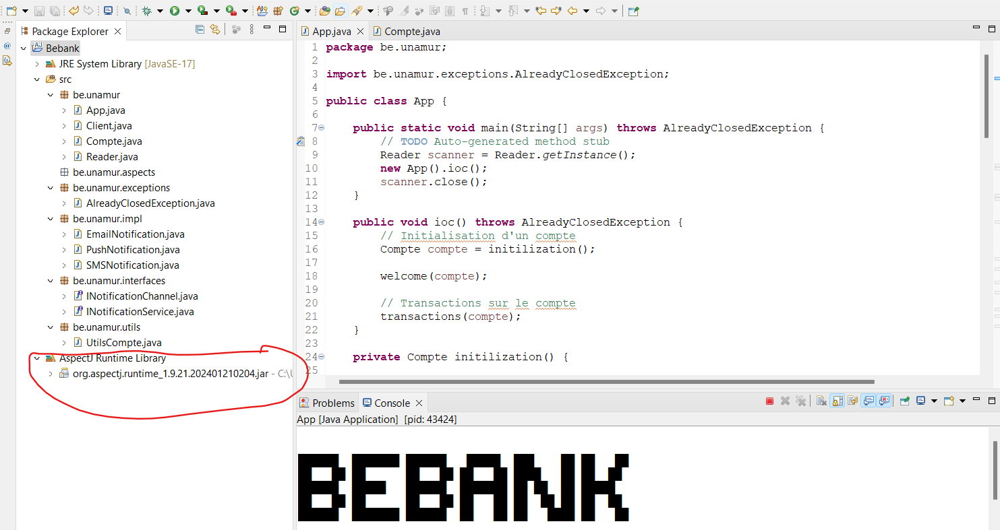

Nous allons pouvoir créer maintenant des aspects. Pour ce faire:

!!! example "A faire"
    1. Créer un aspect `WithoutAnnotationAspect` et `WithAnnotationAspect` pour encapsuler les aspects de sécurité des transactions. Intercepter l'appel des méthodes `deposer` et `retirer` avant leur exécution.

### Ancienne synthaxe de création

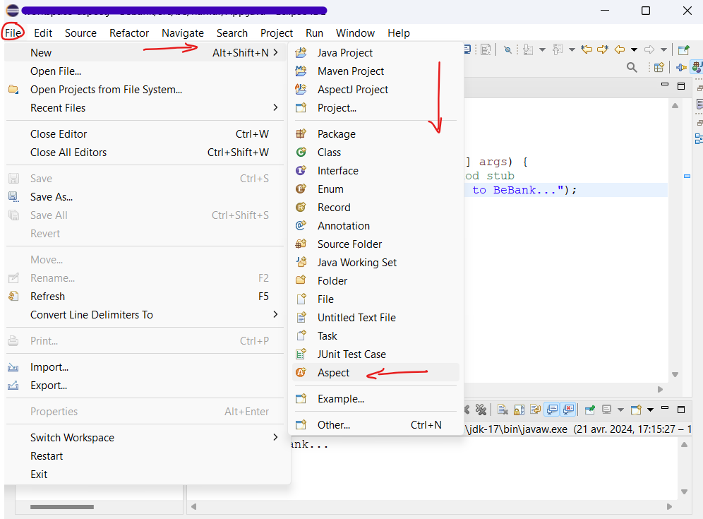

Voici le code source de l'aspect

```java linenums="1" hl_lines="6-7 9 13"

package be.unamur.aspects;

public aspect WithoutAnnotationAspect {
	
	// Permet de gérer le contrôle des données avant les transactions
	pointcut deposerControl(): execution(public be.unamur.Compte deposer(Float));
	pointcut retirerControl(): execution(public be.unamur.Compte retirer(Float));
	
	before(): deposerControl(){
		System.out.println("[Aspect] Control avant le dépôt d'argent");
	}
	
	before(): retirerControl(){
		System.out.println("[Aspect] Control avant le retrait d'argent");
	}

}

```

!!! question "Questions"
    Pour `WithoutAnnotationAspect`, vous devriez aboutir au résultat suivant. Quelles sont les informations que donne la `Cross References View` ?

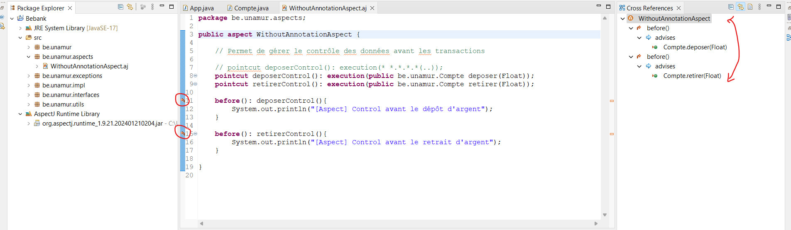

Résultat après exécution:

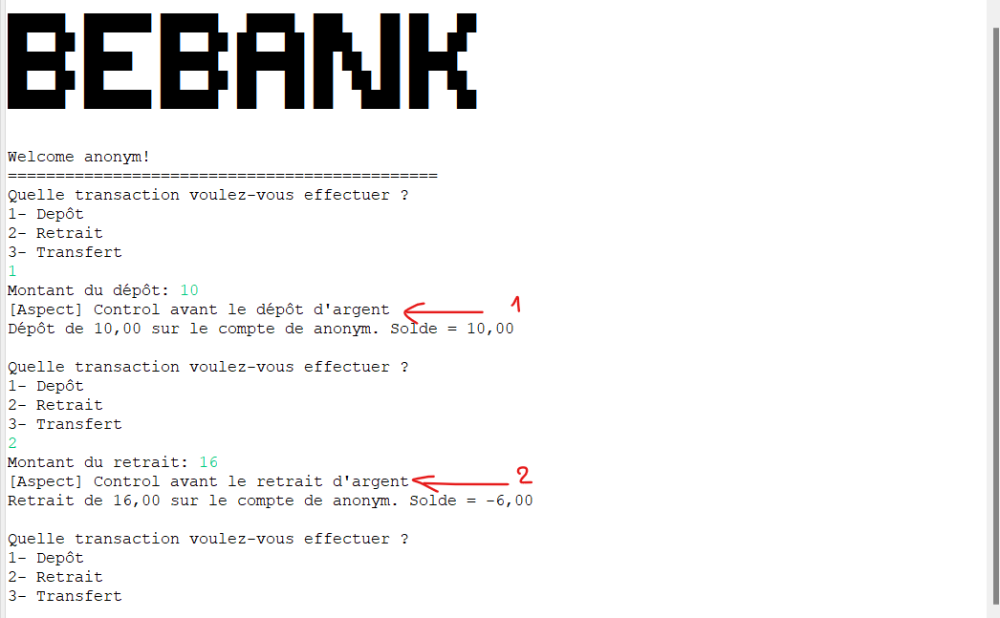


### Création à l'aide d'annotations

!!! example "A faire"
    1. Créer  l'aspect `WithAnnotationAspect`.
    2. Créer deux aspects permettant d'envoyer d'email et de SMS au client après l'opération de retrait. Pas besoin d'implémenter les fonctionnalités en question, faites juste des affichages en console.

Code source:

```java linenums="1" hl_lines="10-11 15 21"
package be.unamur.aspects;

import org.aspectj.lang.annotation.Aspect;
import org.aspectj.lang.annotation.Pointcut;
import org.aspectj.lang.annotation.After;

@Aspect
public class WithAnnotationAspect {
	
	@Pointcut("execution(public be.unamur.Compte retirer(Float))")
	public void retirerPostEvent() {
		
	}
	
	@After("retirerPostEvent()")
	public void retirerEmailEvent() {
		// Envoyer un email au client
		System.out.println("[@spect] Envoi de mail au client après le retrait d'argent");
	}
	
	@After("retirerPostEvent()")
	public void retirerSMSEvent() {
		// Envoyer un SMS au client
		System.out.println("[@spect] Envoi de SMS au client après le retrait d'argent");
	}

}
```

Résultat en console:

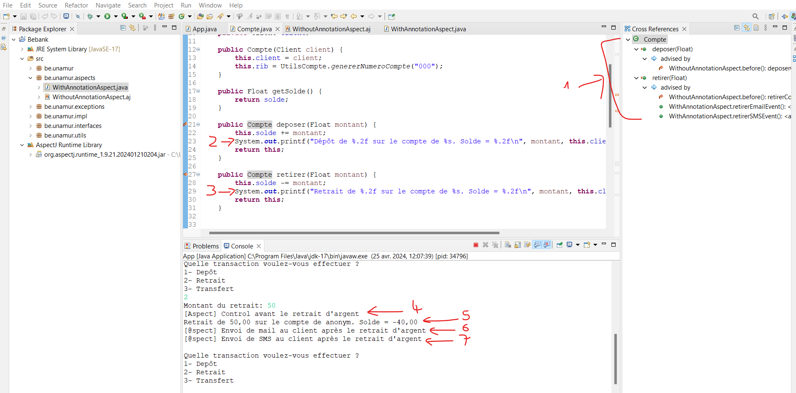


!!! warning "Pour la suite ..."
    Commentez les `lignes 2 et 3 annotés` sur l'image précédante et aussi annuler l'effet des aspects.


## II- Manipuler un pointcut

### Variable `thisJoinPoint` et `Wilcards`

### Logging

!!! example "A faire"
    1. Séparer la préoccupation transversale de log du code métier en utilisant un aspect `LoggingAspect` qui ne trace que les dépôts et les retraits en affichant en console l'identité du client, le montant de la transaction et le numéro de compte impliqués dans les transactions.

Code à manipuler:

``` java linenums="1"
package be.unamur.aspects;

import java.util.logging.Logger;

import be.unamur.Compte;

public aspect LoggingAspect{
	
	private static int compteur = 1;
	
	Logger log = Logger.getLogger(this.getClass().getName());
	
	private static String transactionType(String methodName) {
		String numeroTransaction = "";
		 if(methodName == "deposer") 
	    	numeroTransaction = String.format("TR%d ==>", compteur);
		 else if (methodName == "retirer") 
	    	numeroTransaction = String.format("TR%d <==", compteur);
		 return numeroTransaction;
	}
	
    /* === poincut ==== */
	pointcut transactionLog(): 
	(
        xxx
	);
	
    /* === advice === */
	xxx(): transactionLog(){

        // récupérer le compte sur lequel s'opère la transaction

        // récupérer le nom de la méthode

        String transaction = transactionType(methodName);
        
        String trace = String.format("[%s %s(%s); Montant = %.2f; Solde = %.2f]\n", transaction, compte.getRib(), compte.getClient().getIdentite(), montant, compte.getSolde());
        log.info(trace);
        compteur++;

	}

}
```

Voici le résultat attendu:

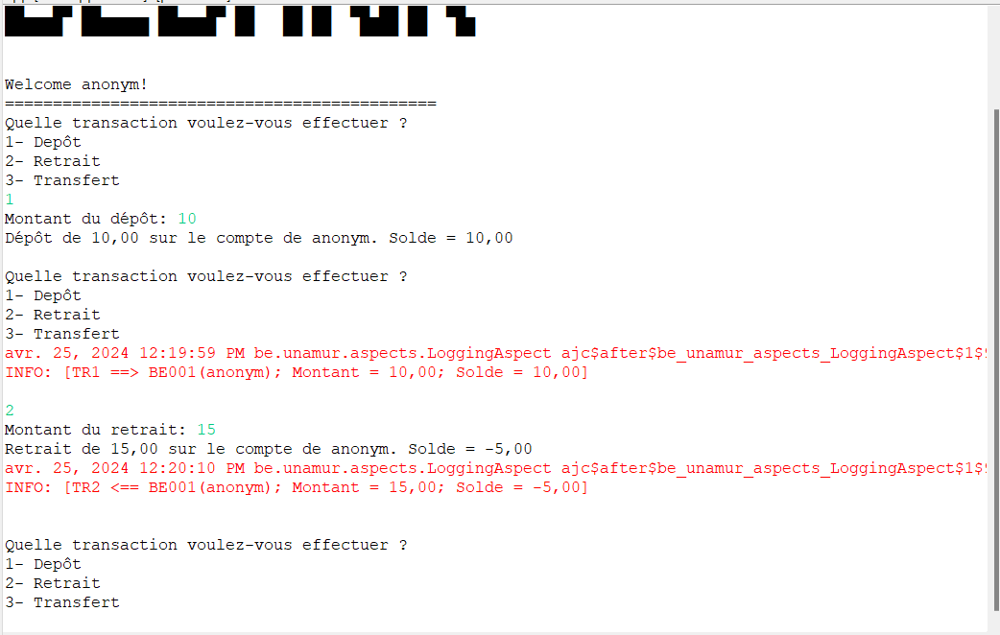

!!! question "Questions"
    1. Quelle est la différence entre les bouts de code suivants ? Astuce (Expliquer à l'aide du code)

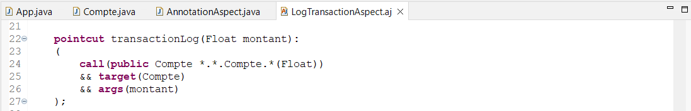

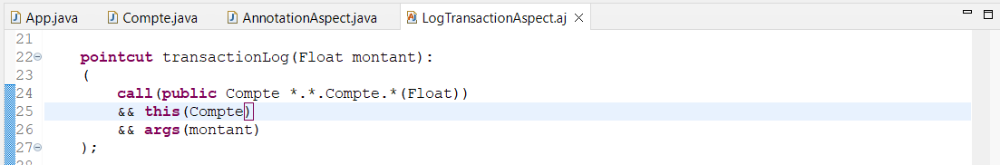

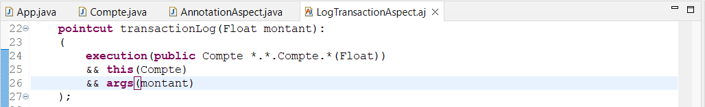


### Solde non négatif

Vous auriez remarqué que des retraits négatifs sont possibles. Nous allons essayez d'y remédier avec un aspect.

!!! question "Questions"
    1. Vérifier le solde du compte avant de procéder à des opérations pour éviter les retraits négatifs. Créer un aspect `TransactionyAspect à base d'annotation`.

Code de base:

```java linenums="1"
package be.unamur.aspects;

import org.aspectj.lang.JoinPoint;
import org.aspectj.lang.annotation.Aspect;
import org.aspectj.lang.annotation.Pointcut;

import be.unamur.Compte;

@Aspect
public class TransactionAspect {

	@Pointcut("xxx")
	public void retirerTransactionSecurity() {}	
	
	
	@xxx("retirerTransactionSecurity(montant)")
	public void retirerSecurityAdvice(JoinPoint joinPoint){
		// Récupérer le compte
		
        // Comparer le montant du retrait au montant dans le compte
		if(montant > compte.getSolde()) {
			/*errorInTransaction = true;*/
			throw new RuntimeException("Compte insuffisant: "+ montant + " > " + compte.getSolde());
		}
	}
}

```

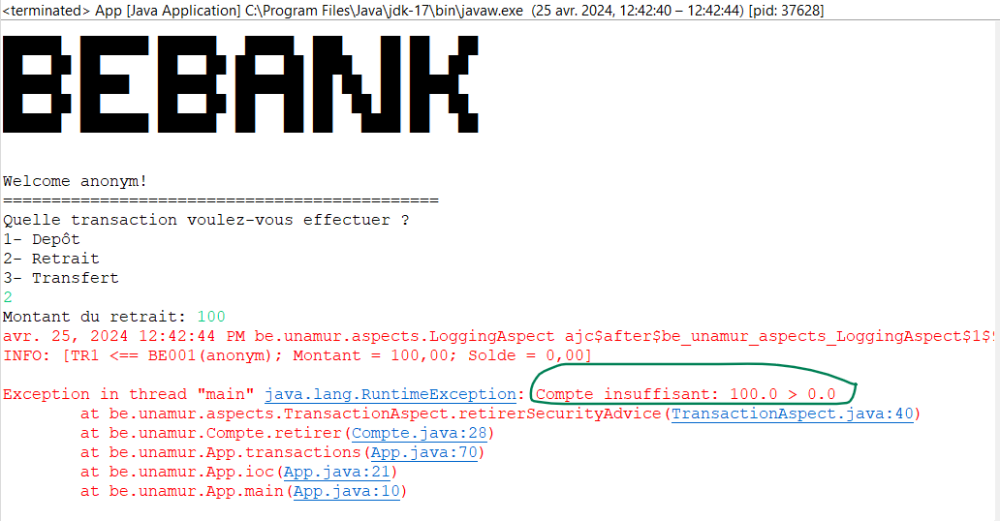

### Précédence sans mécanisme AspectJ

!!! example "A faire"
    1. Nous remarquons dans la capture précédente que les logs s'effectuent avant le déclenchement de l'erreur, ce qui donne un comportement incohérent. Corriger cela en utilisant une variable `static volatile`

Résultat attendu: 

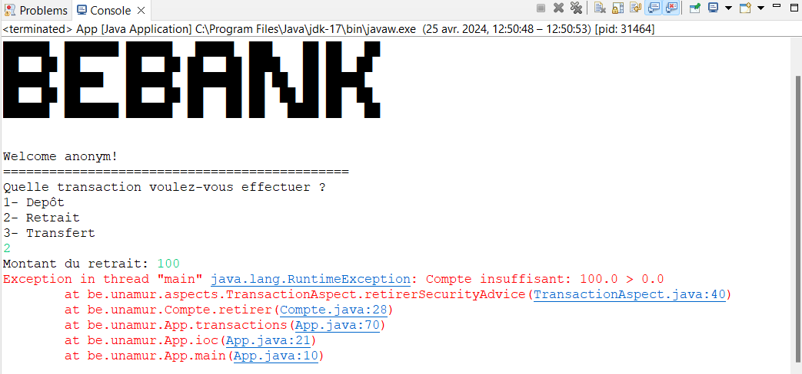

Nous allons à présent ajouter le mécanisme d'authentication.

### Login with `around`

!!! example "A faire"
    1. Ajoutez le mécanisme de connexion avec un identifiant et un mot de passe

Code de base:

```java linenums="1"
package be.unamur.aspects;
import be.unamur.Client;
import be.unamur.Compte;
import be.unamur.Reader;
import be.unamur.exceptions.AlreadyClosedException;

public aspect AuthenticationAspect {
	
	// récupérer les paramètres de connexion de bob
	String myLogin = "bob";
	String myPass = "123";
	Client client = new Client(myLogin, myPass);
	
	pointcut login(): (
		xxx
	);
	
	Compte around(): login(){
		
		Compte compte = null;
		try {
			Reader scanner = Reader.getInstance();
			System.out.print("Votre identite: ");
			String identite = scanner.next();
			System.out.print("Votre password: ");
			String password = scanner.next();
			
			// Méchanisme de vérification des paramètres fournis
			if(myLogin.equals(identite) && myPass.equals(password)) {
				try {
					// Zapper
					// proceed();
					// Retourner le compte de bob depuis la base de données
					// Ici nous allons nous contenter d'initialiser un compte
					compte = new Compte(client);
					
					// Charger ses contacts
					chargerContacts(client);

				}catch(Throwable e) {
					e.printStackTrace();
				}
			}else {
				// Informer que la connexion n'est pas possible
				throw new RuntimeException("Identifiants incorrects");
			}
			
		}catch(AlreadyClosedException a) {
			
		}
		return compte;
	}

	private void chargerContacts(Client client) {
		System.out.printf("Chargement des contacts de: %s\n", client.getIdentite());
		// Chargement des comptes de ses contacts depuis la base de données
		// le chargement doit être dynamique pour tenir compte de chaque client
		client.addContact("aline", new Compte(new Client("aline")));
		client.addContact("peter", new Compte(new Client("peter")));
		client.addContact("zoe", new Compte(new Client("zoe")));
	}

}

```

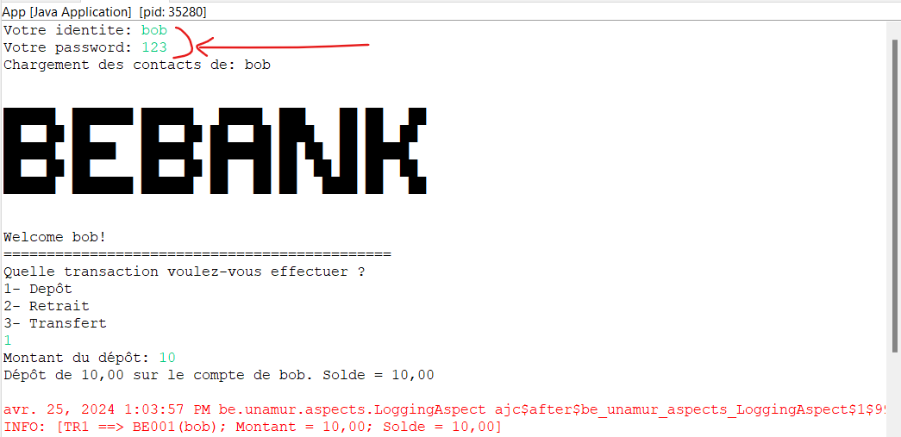


### Changement du format rib

!!! example "A faire"
    Changer le format pour un format "0000000000" quand l'authentification est effectuée. 
    
!!! warning
    `Hypothèse: ` lorsque `AuthenticationAspect` est désactivé, tous les pointcuts le sont aussi.

Sans connexion:

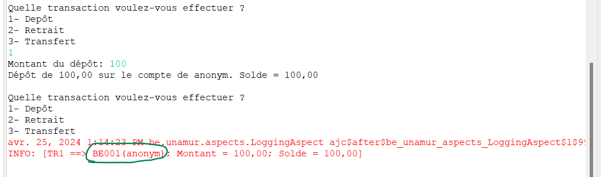

Avec connexion:

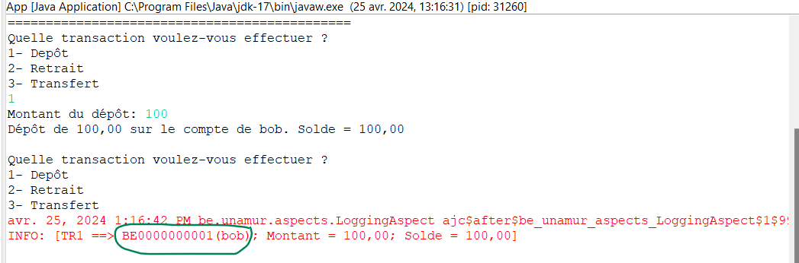

### Vérification avant retrait
!!! example "A faire"
    Ajoutez dans `AuthenticationAspect` la capacité de demander à l'utilisateur de s'identifier avant tout retrait, même les retraits au cours des transferts. 

Résultat attendu:

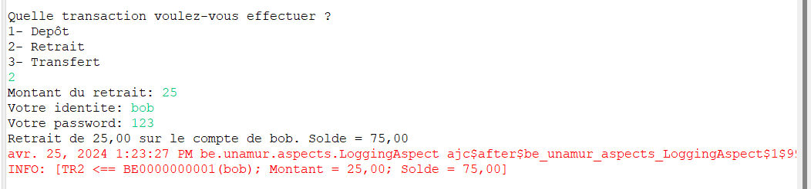

!!! warning
    Pour la suite, ajouter ce bout de code dans `TransactionAspect` afin de suivre la propagation des erreurs dans les transactions et de réinitialiser la variable `errorInTransaction` sinon les logs ne s'afficheront plus après un transfert.

Problème:

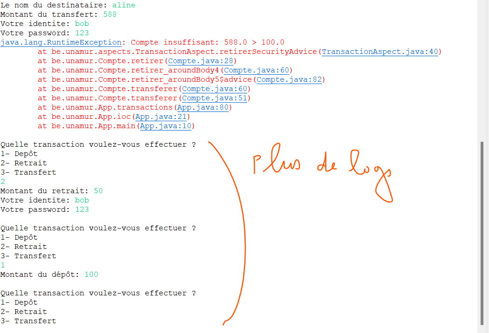
    

Code à ajouter dans `TransactionAspect`

```java linenums="1"
@Pointcut("(call(* *.*.Compte.*(Float)) || call(* *.*.Compte.transferer(String, Float)))")
	public void errorInTransactionInit() {}
	
@Before("errorInTransactionInit()")
public void errorInTransactionAdvice(JoinPoint joinPoint){
    String thisName = joinPoint.getThis().getClass().getName();
    if(thisName=="be.unamur.App") {
        errorInTransaction = false;
    }
}
```

### Synchronization

Mettre à jour le solde du compte de manière atomique pour garantir l'intégrité des données. Astuce (Synchroniser les méthodes `retirer`, `deposer`, `transferer`). Ajoutez un poincut dans l'aspect `TransactionAspect`

Evitez le scénario suivant:

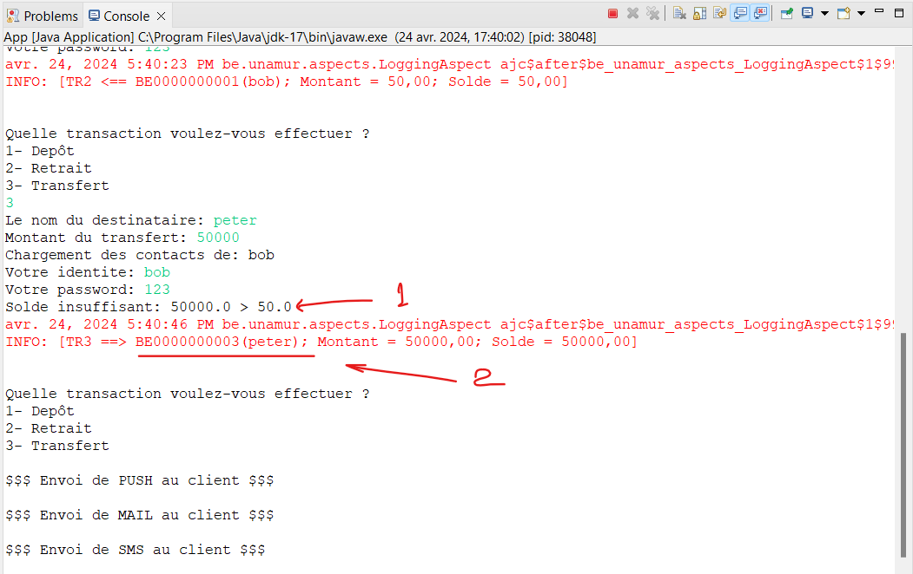


### Pointcut `Initialization` et méchanisme d'introduction

!!! example "A faire"
    Nous disposons de trois mécanismes de notification au client lors d'un `dépôt sur son compte`. Veuillez permettre au client de choisir le mécanisme qui lui convient et permettre l'extensibilité du code en conséquence avec l'aspect `NotificationAspect`.

Code de base:

```java linenums="1"
package be.unamur.aspects;

import be.unamur.Compte;
import be.unamur.impl.*;
import be.unamur.interfaces.INotificationChannel;
import be.unamur.interfaces.INotificationService;

public aspect NotificationAspect {

	// =========== NOTIFICATIONS PAR 1..* CANAUX CHOISI(S) ===============
	// Lier l'interface à une implémentation par défaut
	INotificationChannel[] notificationChannels = {
			new PushNotification(),
			//new EmailNotification(),
			//new SMSNotification(),
	}; 
	
	declare parents:Compte implements INotificationService;
	
	// Ajout le channel du client sur ce compte
	private INotificationChannel[] Compte.channels;
	// Le setter du channel
	public void Compte.setChannels(INotificationChannel[] channels){
		this.channels = channels;
	}
	//Le getter du channel
	public INotificationChannel[] Compte.getChannels(){
		return channels;
	}
	
	public void Compte.send() {
		if(!TransactionAspect.errorInTransaction) {
			// Diffuser aux channels choisis
			xxx
		}
	}

	// === LIAISON DE 1..* CANAUX DANS LE CONSTRUCTEUR ==================
	pointcut sendNotification(): (
		xxx
	);
	
	xxx(): sendNotification(){
		
		xxx
		
	}
	
	
	// === ALERTE ENTREE D'ARGENT =======================================
	pointcut entreeArgent(): (
		xxx
	);
	
	xxx(): entreeArgent(){
		xxx
	}

}

```

Résultat attendu:

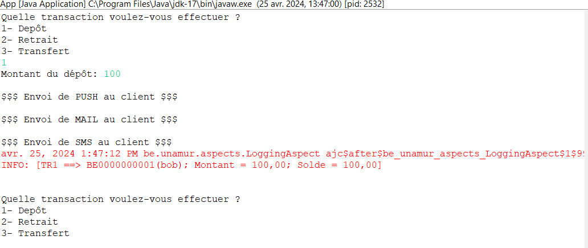

### Optimisation et traitement parallèle

!!! example "A faire"
    Afin d'alléger l'envoi des notification et de profiter des capacités `hardware`, tu es invité(e) à utiliser la programmation par aspect pour mettre en parallèle les tâches lourdes.

Code de base:

```java linenums="1"
package be.unamur.aspects;

public aspect ParalleleAspect {
	
	pointcut parallelTask(): (
		xxx
	);
	
	void around(): parallelTask(){
		
		xxx
	}
	
}
```

Résultat attendu:

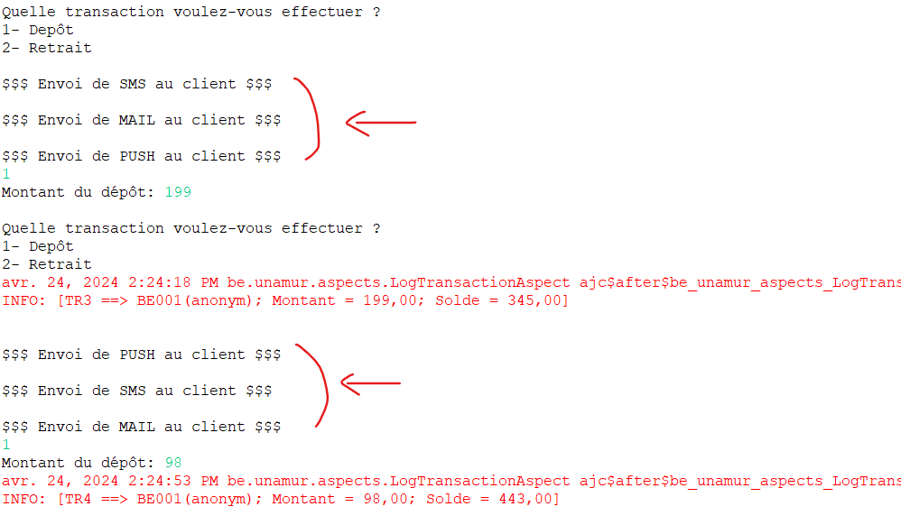

!!! question "Questions"
    1. Que remarquez-vous par rapport aux aspects `NotificationAspect`et `parallelTask` au vu de leur dépendance. Astuce (commentez l'un pour voir l'effet sur l'autre)


### Problème de précédence 😬

🔥🔥🔥 Vous venez venez de remarquer que l'application donne une `idée du maximum d'argent dans le compte du client` avant de vérifier la légitimité de celui qui veut opérer le retrait. 🔥🔥🔥

Allez à la rescousse de `Bebank` sinon elle risque non seulement de fermer mais d'être aussi poursuivie. 🤠

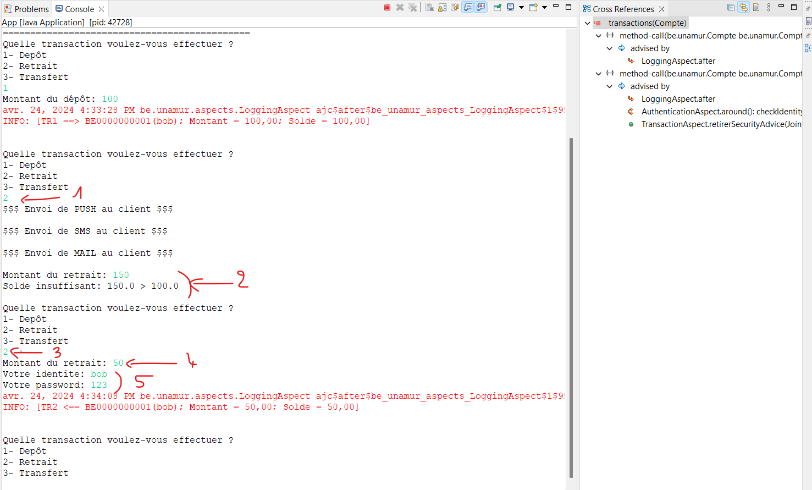

Résoudre le problème qui se pose en suivant les étapes ci-dessous: 

!!! example "A faire"
    1. Trouver une manière de faire passer l'execution de l'aspect `AuthenticationAspect` avant l'aspect `TransactionAspect` sur certains pointcuts.

Résultat attendu:

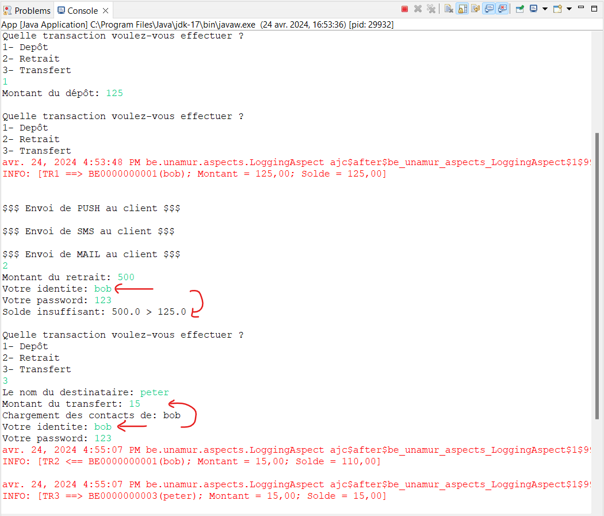
