# TP Docker

**Objectif**

A la fin de cette section, tu seras capable de déployer un site wordpress basé sur la technologie docker.

**Contenu**

[Installation](#installation) <br>
[Docker Desktop](#docker-desktop) <br>
[I- Récupérer une image](#i-recuperer-une-image) <br>
[II- Manipuler des conteneurs](#ii-manipuler-des-conteneurs) <br>
[III- Automatiser les services](#iii-automatiser-les-services) <br>
[IV- Persister les données](#iv-persister-les-donnees) <br>
[V- Contruire une image](#v-construire-une-image) <br>
[VI- Publier une image sur le Hub](#vi-publier-une-image-sur-le-hub) <br>
[VII- Nettoyer les ressources orphelines](#vii-nettoyer-les-ressources-orphelines) <br>

## Installation

!!! question "Questions"

    1. Au cours de l'installation de docker, vous aviez dû (pour ceux qui sont sur Windows) permettre l'utilisation du client `Hyper-V` en activant la `virtualisation dans le BIOS` ou vous aviez dû installer `WSL (Windows Subsystem for Linux)`. Quel en est l'utilité ?
    2. Que savez-vous de `docker engine` et de `docker deamon` ?
    3. Quelle est la version de `docker` installé ?
    4. Quelle est la version de `Docker Compose` installé ?

## Docker Desktop

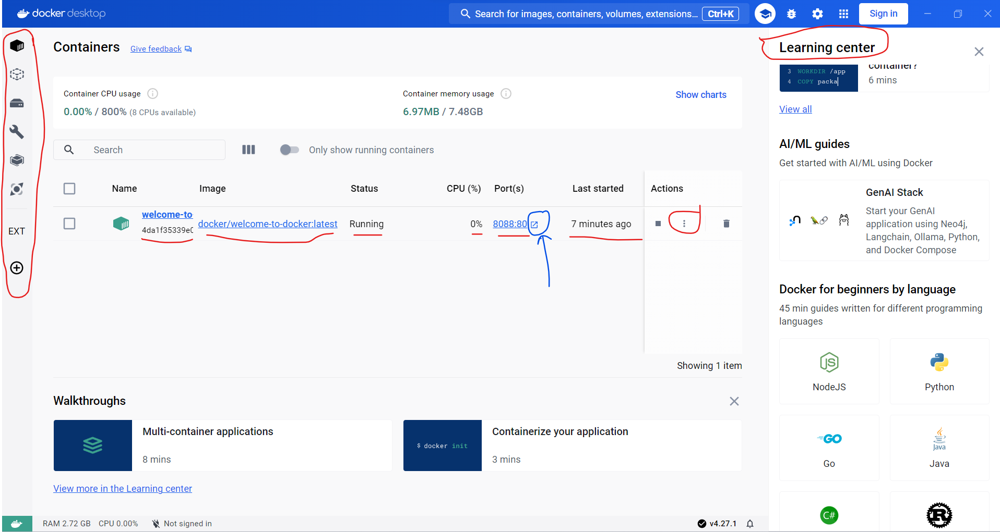

!!! question "Questions"

    1. Lancez votre premier conteneur comme sur l'image. Quelles difficultés rencontrez-vous?
    2. Commentez les zones mis en évidence ?
    3. Quel est le nom du conteneur ?
    4. Que signifie les ports `8088:80`?

Dans la suite du TP, nous allons essayer de lancer un site web wordpress dans un conteneur docker et en faire un sauvegarde sur notre hub. Pour y arriver, voici les grands axes du TP:

> 1) Récupérer une image de wordpress sur docker-hub
>
> 2) Installer la base de données et faire communiquer les conteneurs
>
> 3) Automatiser le démarrage et l'extinction des services avec Docker Compose
>
> 4) Créer son propre image et l'envoyer sur le hub


## I- Récupérer une image

> 1) Récupérer une image de wordpress sur docker-hub

Dans cette section, nous allons récupérer une image de wordpress sur docker-hub. Allez sur docker-hub, et rechercher `wordpress`

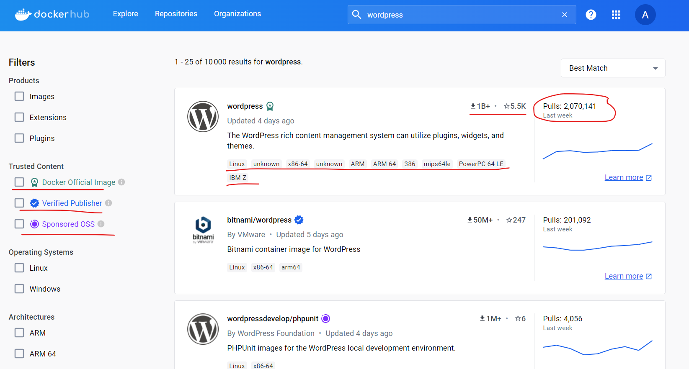

!!! question "Questions"

    1. Commentez les zones mis en évidence ?
    2. Quelle est la commande pour récupérer l'image de wordpress ? Astuce (Aller dans le détail de l'image choisie)

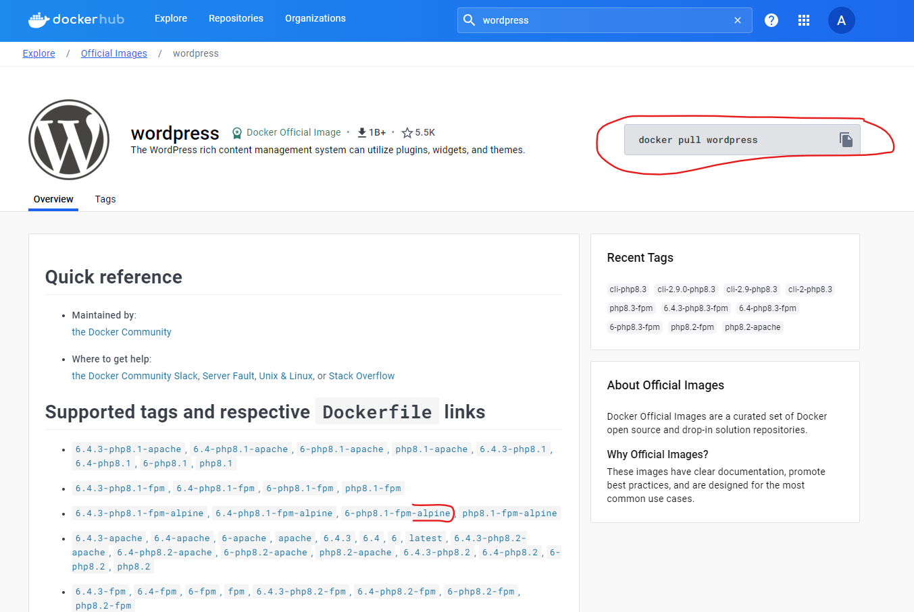

!!! question "Questions"

    1. Pouvez-vous commenter les différentes zones de ce résultat ?
    2. Quelle est la version actuelle de wordpress ? Est-ce qu'il existe une image de docker dans cette version ?
    3. Que veut dire `alpine` ?

Dans la section suivante nous allons lancer un conteneur basé sur `wordpress`

## II- Manipuler des conteneurs

### Format des commandes de docker

- Ancienne (Travaille toujours)
> docker < command > [option] 
    exemple : docker run --publish

- Nouvelle
> docker < command > < sub-command > [option]  
    exemple : docker container stop --publish

### Lancer un conteneur

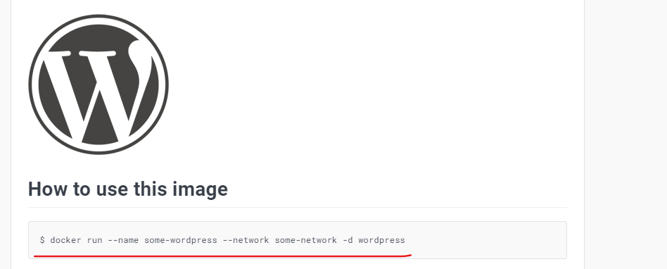

!!! question "Questions"

    1. Décrivez les composantes de la commande ci-dessus ?

Exécutez la commande suivante :

```bash
docker run --name some-wordpress --network some-network -d wordpress
```

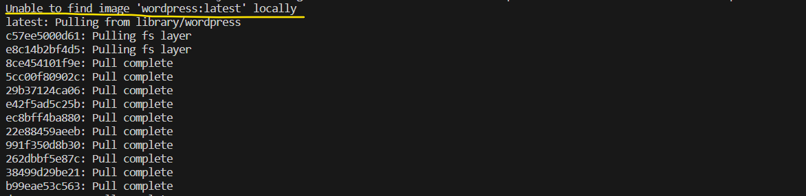

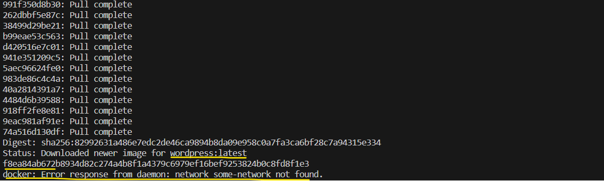


!!! question "Questions"

    1. Expliquez les parties mises en évidence ?
    2. Pourquoi la commande a t-elle échouée ?

Exécutons plutôt cette commande sans l'option `--network`:

```bash
docker run --name some-wordpress -p 8080:80 -d wordpress
```

!!! question "Questions"

    1. Pour quelle raison cette commande ne fonctionne-t-elle pas non plus ?
    2. Constatez la présence du conteneur dans `docker desktop`. Quel est son état ?

Lancez le conteneur avec un autre nom:

```bash
docker run --name my-wordpress -p 8080:80 -d wordpress
```

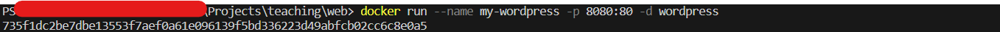

!!! question "Questions"

    1. Que signifie l'identifiant mis en évidence ?
    2. L'`image docker` a t-elle été téléchargée à nouveau ?

Vérifiez la disponibilité du site à l'adresse [`http://127.0.0.1:8080`](http://127.0.0.1:8080){:target="_blank"}.

### Voir les logs

Sur `docker desktop`, voir les logs du conteneur `my-wordpress`

Les logs d'un conteneur peuvent aussi être consultés avec la commande:

```bash
docker container logs my-wordpress
```

### Supprimer un conteneur

Supprimer le conteneur qui ne fonctionne pas dans `docker desktop`.

!!! question "Questions"
    1. Quelle est la commande exécutée en arrière plan ?
    2. Les volumes associées aux conteneurs sont-elles persistées ?

Cela nous obligera à faire quelques réajustements. En effet, un conteneur de base de données, ne doit pas perdre ses données à chaque suppression.

### Renommer un conteneur

Dans cette partie, nous allons renommer le conteneur `my-wordpress` en `my-site`

!!! warning
    Avant d'exécuter la commande suivante, gardez en mémoire l'identifiant du conteneur.

```bash
docker container rename my-wordpress my-site
```

!!! question "Questions"
    Est ce que l'identifiant du conteneur renommé, a changé ?

### Se connecter à un conteneur

**Utilisation de `docker desktop`**

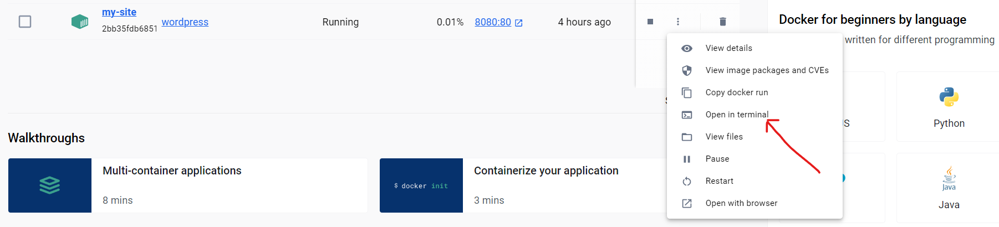

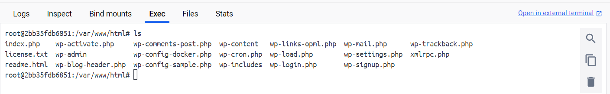

!!! info
    Tapez la commande `bash` après connection afin d'utiliser le `Bourne-Again shell (bash)` au lieu de `Bourne Shell (sh)`

**En ligne de commande**

```bash
docker container exec -it my-site bash
```

Installer le package `ascii`

```bash
apt-get update && apt-get install ascii
```

### Inspecter un conteneur

Utilisez `docker desktop` pour inspecter. Nous pouvons voir que le conteneur à des paramètres réseaux.

!!! question "Questions"
    1. Quelle est l'`adresse ip` du conteneur et quel est le `network` par défaut ? Astuce (ce réseau est encore appelé `docker0`)
    2. Quels sont les drivers qu'offre docker pour gérer un réseau de conteneurs ? Astuce ([Documentation officielle](https://docs.docker.com/network/#drivers){:target="_blank"})
    3. Sur votre machine, identifiez la carte réseau virtuelle créée par docker pour gérer le trafic des conteneurs ? Astuce (`ipconfig` sous windows)

La commande suivante permet d'afficher la liste des réseaux disponibles :

```bash
docker network ls
```

### Communication entre conteneurs

!!! warning "Legacy"

    L'utilisation de l'option `--link` pour lier les conteneurs est obsolète.

> 2) Installer la base de données et faire communiquer les conteneurs

La base de données n'étant pas encore disponible, nous ne pourrions pas poursuivre notre installation.

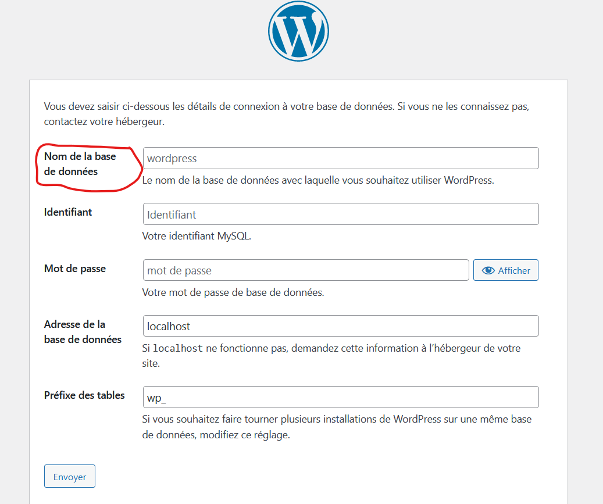

Nous allons devoir lancer un conteneur de base de données. Pour cela effectuer les tâches suivantes:

#### Première approche (bridge network)

La communication entre les conteneurs se fera depuis l'extérieur. Les deux conteneurs étant exposés sur des ports externes `8000` pour `wordpress` et `3306` pour `mysql`

**A faire :**

- Lancer un conteneur de base de données avec l'image `mysql:8.3.0` en faisant attention à la documentation et aux ports à exposer. Dans notre cas, le port par défaut de `mysql` est `3306` et il doit être exposé à l'extérieur sur le même port. Vous pouvez définir votre mot de passe. Pour faire simple, je garderai `admin`.

<!--

```bash

docker run --name db -p 3306:3306 -e MYSQL_ROOT_PASSWORD=admin -d mysql:8.3.0

```
-->

!!! question "Questions"
    1. Dans quel cas le lancement du conteur échouera, au regard des ports ?

<!--
2- Echec si une application tourne déjà sur le port demandé par le conteneur.
-->

- Créer la base de données `mysite` en ligne de commande. C'est elle que nous utiliserons pour notre site.

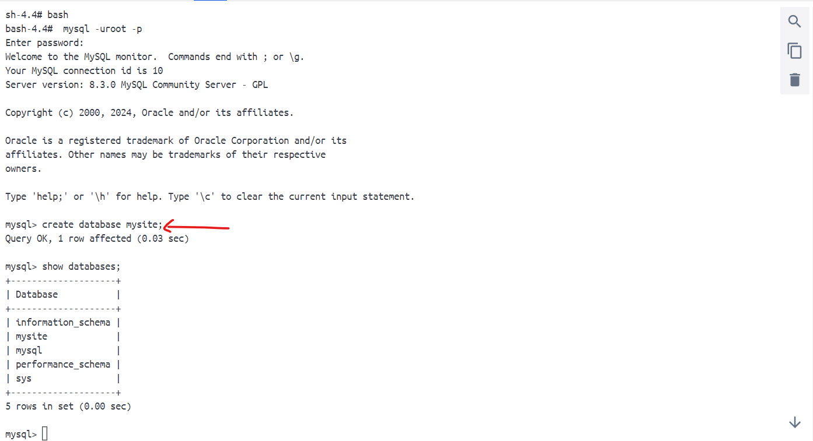

- Continuer et achever l'installation en ajoutant les paramètres de connexion au conteneur de base de données.

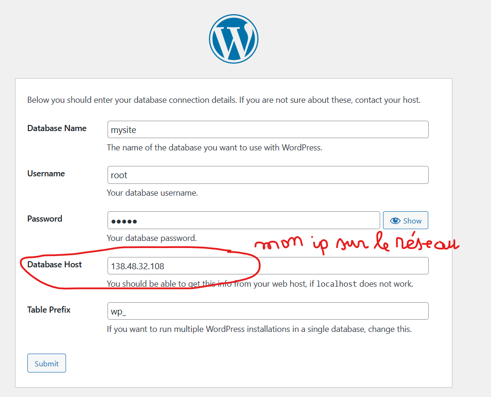

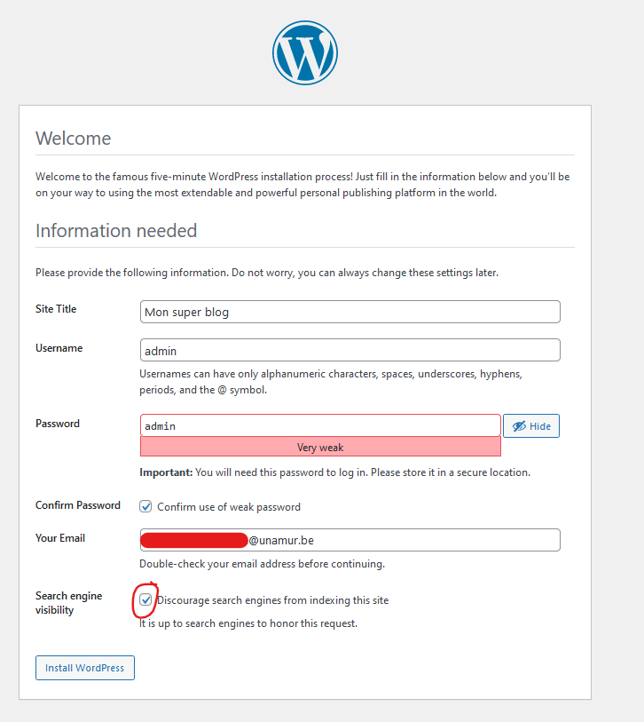

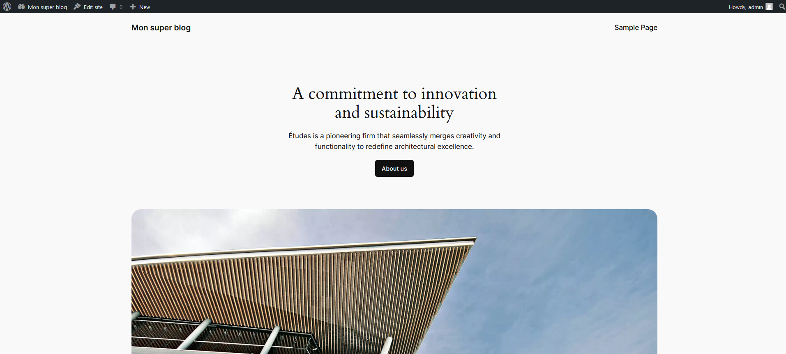


#### Deuxième approche (host network)

**Caractéristiques**

- Pas d'isolation réseau entre le conteneur et l'hôte
- Pas besoin d'ip pour le conteneur
- Les conteneurs communiquent entre eux et avec l'`hôte` mais ne sont pas accessible depuis l'extérieur.
- Les conteneurs se comportent comme des processus de l'`hôte`.

Mettons tout cela en évidence :

```bash
docker run --name db --publish 3306:3306 --network host -e MYSQL_ROOT_PASSWORD=admin -d mysql:8.3.0
```
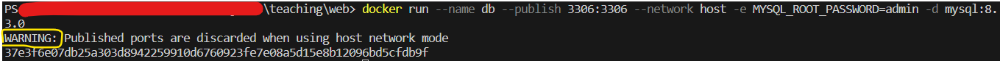

!!! question "Questions"

    1. Quelle compréhension avez-vous du `warning` dans la capture ?


!!! warning "Attention"
    Vous auriez besoin de recréer la base de données car elle n'est pas persistée. C'est à dire elle a été perdue à la destruction du conteneur.

Ensuite ...

```bash
# Créer le conteneur de wordpress et le connecter au réseau `host`
docker run --name my-site --network host -d wordpress
```

Connectez vous au conteneur et exécuter la commande suivante:

```bash linenums="1"
curl -v http://localhost

# Voir la liste des ports ouverts
netstat -lutpn
```
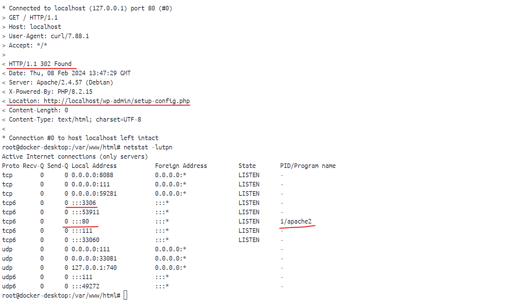


Les conteneurs communiquent bien entre eux. Quid de la visibilité depuis l'extérieur ?

Sur votre machine, exécuter les commandes suivantes. 

```bash linenums="1"
# Sur windows
netstat -ano | grep "3306\|80"
# Sur linux ou macOS
netstat -lutpn | grep "3306\|80"
```
!!! question "Questions"
    Que constatez-vous ?

La première approche avec `bridge` nous semble la plus appropriée pour ce cas d'exemple. Mais nous pouvons encore faire mieux en proposant une architecture notre site web est bien accessible depuis l'extérieur et fonctionnelle mais pas notre base de données.

!!! question "Questions"
    Pouvez-vous dessiner une telle architecture ?

#### Troisième approche (custom network)

Nous allons exécuter les commandes suivantes après avoir détruit les conteneurs

```bash linenums="1"
# Créer notre réseau personnalisé
docker network create --driver=bridge ntw

# Lancer ma base de données sans la publier. 
# C'est à dire enlever l'option `-p|--publish`
docker run --name db --network ntw -e MYSQL_ROOT_PASSWORD=admin -d mysql:8.3.0

# Recréer la base de données mysite
# bash-4.4# mysql -uroot -p
# mysql> create database mysite;

# Lancer le conteneur `wordpress` en l'exposant à l'extérieur
docker run --name my-site --network ntw -p 8080:80 -d wordpress
```

Après ces commandes, lancer le lien [`http://localhost:8080`](http://localhost:8080){:target="_blank"}. Vous devriez aboutir à une telle interface. Mettez `db` dans le champ `Database Host`

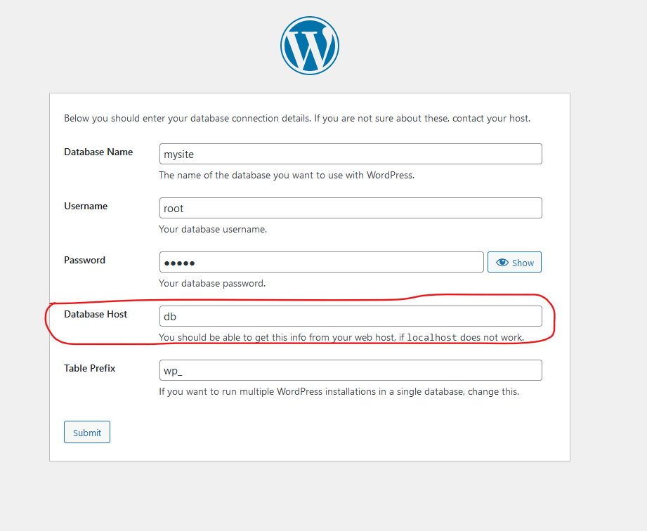

!!! question "Questions"
    1. D'où vient `db` ?
    2. Quelle fonctionnalité de docker a été mis en évidence ? Astuce ([Plus de détails...](https://medium.com/@prajwal.chin/understanding-docker-dns-2ed4b070a0){:target="_blank"})

Tout fonctionne maintenant à merveille. Mais nous pouvons automatiser le démarrage et l'extinction de nos services avec `Docker Compose`. Rien de plus simple 😜

> 3) Automatiser le démarrage et l'extinction des services avec `Docker Compose`

## III- Automatiser les services

Créons un répertoire pour notre projet et créons un fichier particulier `docker-compose.yml`. 

Bien sûr vous pouvez utiliser un autre nom pour le fichier mais il faudra le spécifier à docker. Nous ferons simple pour l'instant. 

Ce fichier doit se trouver à la racine de votre projet.

Voici un exemple de contenu.

```yml linenums="1" hl_lines="1 6-7 9 11 16 18 34 37"
version: '3.3'

services:

  wordpress:
    container_name: apache-wp
    image: wordpress:latest
    restart: always
    ports:
      - 8080:80
    environment:
      WORDPRESS_DB_HOST: db
      WORDPRESS_DB_USER: root
      WORDPRESS_DB_PASSWORD: admin
      WORDPRESS_DB_NAME: mysite
    volumes:
      - wp_data:/var/www/html
    depends_on:
      - db
    networks:
      - ntw

  db:
    container_name: mysql-db
    image: mysql:8.3.0
    restart: always
    environment:
      MYSQL_ROOT_PASSWORD: admin
    volumes:
      - db_data:/var/lib/mysql
    networks:
      - ntw

networks:
  ntw:

volumes:
  wp_data:
  db_data:
```

!!! question "Questions"
    1. Que veut dire `wordpress:latest` et quel inconvénient il y a t-il à utiliser le tag `latest` ?
    2. Quelles sont les autres utilisations des volumes ?
    

!!! warning "Legacy"
    Dans les versions récentes de `Docker Compose`, la commande est en deux mots `docker compose ...` et non ~~`docker-compose ...`~~

En ligne de commande, exécuter la commande suivante pour lancer les conteneurs:

```bash
# Contruire et lancer vos services
# Se base sur le fichier `docker-compose.yml` positionné dans
# le répertoire à partir duquel la commande est exécutée.
# -p|--project-name: pour mettre un prefixe aux ressources 
# générées sinon `Docker Compose` gardera le nom du docker comme étant le préfixe
docker compose -p mysite up -d
```

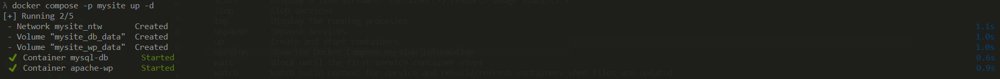

Les volumes créés sont visibles dans `Docker desktop`

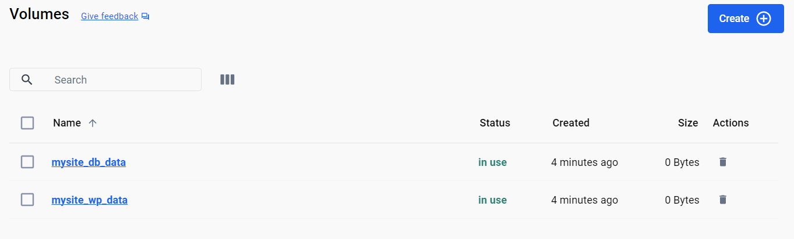

!!! info "Docker Compose: commandes utiles"

    1. `docker compose up -d`: démarrer l'ensemble des services en arrière-plan;

    2. `docker compose ps`: voir le statut de l'ensemble de vos services;

    3. `docker-compose stop`: arrêter l'ensemble des services;

    4. `docker-compose down`: détruire l'ensemble des ressources;

    5. `docker-compose config`: valider la syntaxe de votre fichier docker-compose.yml

[Aller plus loin](https://docs.docker.com/compose/compose-file/){:target="_blank"}

!!! danger "Finalisez l'installation de wordpress"
    Je sais que nous avions installer plus de mille fois la même application mais promis, ce sera la dernière 😅. Vous pouvez vous en rassurer avec la section suivante.

## IV- Persister les données

Afin de tester la persistence des données, supprimer tout le stack avec la commande `docker compose -p mysite down` et relancer avec `docker compose -p mysite up -d`. Voyez si le site est toujours disponible et que vous n'êtes pas à une installation de wordpress.

A présent que nous savons automatiser la gestion du cycle de vie de nos services, nous personnaliser notre image `wordpress` afin d'inclure un fichier particulier `phpinfo.php` qui nous permettra d'observer les configurations du serveur web.


> 4) Créer son propre image et l'envoyer sur le hub

## V- Construire une image

### .dockerignore

!!! question "Questions"
    `.dockerignore` est un fichier particulier de docker. Devinez à quoi il sert et quelle est son utilité ? Astuce ([Importance de .dockerignore](https://shisho.dev/blog/posts/how-to-use-dockerignore/){:target="_blank"})


### Dockerfile

Les instructions dans le fichier particulier `Dockerfile` permettre de construire son propre image en ajoutant quelques `couches` à l'image de `wordpress:6.4.3-php8.1-apache`.

Voici le contenu du `Dockerfile`. Il doit se trouver au même niveau que le `docker-compose.yml`

```bash linenums="1" hl_lines="2 8"
# Utilisation d'une image PHP officielle
FROM wordpress:6.4.3-php8.1-apache

# Installer Vim
RUN apt-get update && apt-get install -y vim ascii
```

Créer un dossier `www` à la racine du projet. Nous allons synchronisé ce dossier avec le dossier `/var/www/html` présent dans le conteneur.

Aménagement du `docker-compose` pour prendre en compte le `Dockerfile`.

```yml linenums="1" hl_lines="9-10 20"
version: '3.3'

services:

  wordpress:
    container_name: apache-wp
    build:
      context: .
      dockerfile: Dockerfile
    image: wp_phpinfo:1.0.0
    restart: always
    ports:
      - 8080:80
    environment:
      WORDPRESS_DB_HOST: db
      WORDPRESS_DB_USER: root
      WORDPRESS_DB_PASSWORD: admin
      WORDPRESS_DB_NAME: mysite
    volumes:
      - ./www:/var/www/html
    depends_on:
      - db
    networks:
      - ntw

  db:
    container_name: mysql-db
    image: mysql:8.3.0
    restart: always
    environment:
      MYSQL_ROOT_PASSWORD: admin
    volumes:
      - db_data:/var/lib/mysql
    networks:
      - ntw

networks:
  ntw:

volumes:
  wp_data:
  db_data:
```

!!! question "Questions"

    1. La ligne `9` n'est pas nécessaire. Pourquoi ?


Vous pouvez construire votre image Docker en exécutant la commande suivante dans le répertoire :

```bash
# Attention au `.` qui fait partie de la commande à exécuter
docker build -p mysite -t wp_phpinfo:1.0.0 .
```

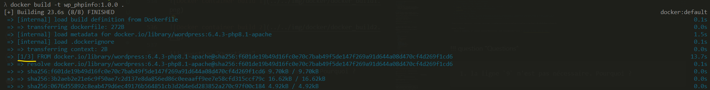

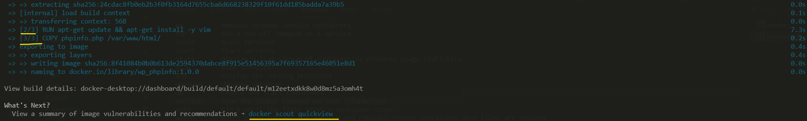


Ensuite supprimer et redémarer les services

```bash linenums="1"
docker compose -p mysite down
docker compose -p mysite up -d
```

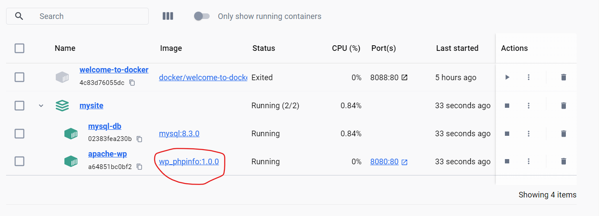


Accédez aux informations du serveur web avec [`http://localhost:8080/phpinfo.php`](http://localhost:8080/phpinfo.php){:target="_blank"}


[Aller plus loin avec Dockerfile](https://docs.docker.com/engine/reference/builder/){:target="_blank"}

## VI- Publier une image sur le hub


## VII- Nettoyer les ressources orphelines

Docker par son activité peut rapidement télécharger beaucoup de volumes de données et certains conteneurs, images, réseaux, volumes peuvent restés orphelins. Il est utile dans certaines conditions de libérer les ressources non utilisées.

Il y a plusieurs commandes de maintenance, mais la plus complète est la suivante. Elle est à utiliser avec parcimonie

```bash
docker system prune
```

!!! example "Allez plus loin"
    Déployez une application springboot avec docker? Astuce ([Examples](https://docs.docker.com/samples/){:target="_blank"} - [Spring Boot application with Maven](https://docs.docker.com/language/java/))