# TP1 GIT

**Objectif** 

A la fin de cette section, tu seras capable de résoudre la plupart des situations d'utilisation de git en entreprise.

**Contenu**

[I- Initialisation d'un dépôt local](#i-init-dun-depot-local) <br>
[II- Zones et cycles de vie des fichiers](#ii-zones-et-cycles-de-vie-des-fichiers) <br>
[III- Initialisation Dépôt distant](#iii-init-depot-distant) <br>
[IV- Synchronisation du dépôt local avec le dépôt distant](#iv-synchronisation-avec-le-depot-distant) <br>
[V- Fichiers ignorés par git](#v-gitignore) <br>
[VI- Développements parallèles](#vi-developpements-paralleles) <br>
[VII- Nettoyage des objets non utilisés](#vii-faire-du-nettoyage) <br>
[VIII- Collaboration](#viii-collaboration)

## I- Init d'un dépôt local
``` bash linenums="1"
cd projet_git # se positionner dans votre espace de travail
git init # initialiser un dépôt
```
!!! question
    Que remarquez vous dans votre espace de travail après avoir lancé la commande d'initialisation du dépôt ?

### Ajout de fichiers

#### Un peu de markdown

[Documentation de markdown ici](../../frameworks/git/index.md#markdown-and-co)

`Markdown` est le type de fichier utilisé par les plateformes de git pour la génération des pages statiques de documentation des projets. Vous pouvez insérer dans un fichier `.md` des balises `html`.

``` markdown linenums="1" hl_lines="1 7"

<pre>
 _  _  ____  ____    __    __    ____  _   _    __     
( \/ )(_  _)(  _ \  /__\  (  )  (  _ \( )_( )  /__\    
 \  /  _)(_  )(_) )/(__)\  )(__  )___/ ) _ (  /(__)\   
  \/  (____)(____/(__)(__)(____)(__)  (_) (_)(__)(__)  

</pre>

# Bienvenu sur mon super blog!
Laboratoire de prise en main de Git

Ce laboratoire ouvre plusieurs perspective à savoir:

* L'envoi des modifications sur un site distant
* La manipulation des historique des commits


[Pour tout autre préoccupation mon IA reste disponible](https://chat.openai.com)

A bientôt 🥳


> [!NOTE]
> C'est un projet démo pour la création d'un blog personnel que je voudrais partager avec la communauté github.

## Contributeurs

- Moi et moi seul 🤓


© < Mon entreprise > Unamur, 2024

```

Pour faire cette jolie bannière passez par [ici](https://patorjk.com/software/taag/){:target="_blank"}

Créer un fichier `README.md` et copiez le contenu précédent à l'intérieur. Le fichier `README.md` est l'entrée de notre site statique sur github similaire à `index.html` pour le `html`


#### Etat du dépôt local

``` bash linenums="1"
git status # inspecter l'état des fichiers
```

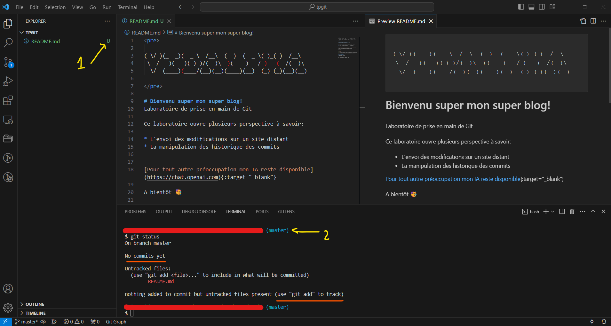

!!! note
    Remarquez que l'extension [`Auto-Open Markdown Preview`](https://marketplace.visualstudio.com/items?itemName=hnw.vscode-auto-open-markdown-preview){:target="_blank"} nous permet d'avoir  nous permet d'avoir un aperçu de notre fichier markdown à droite.

!!! question "Questions"
    1. Commentez les fournies par la commande `git status` en console ?
    2. Que veulent dire `1` et `2`  ?


### Premier commit

A chaque commande faite `git status` pour voir l'état des fichiers.

``` bash linenums="1"
# git add .
# git add -A 
# (pour tracker tous les fichiers du répertoire de travail)
git add README.md
```


```bash linenums="1"
### Description courte
###### Nous allons lancer la commande suivante
git commit -m "Ajout de mon premier commit depuis le local repository"

# ======== OU ===================================

### Description longue sur plusieurs lignes.
git commit -m "Ajout d'une nouvelle fonctionnalité

Cette fonctionnalité permet aux utilisateurs de..."
```

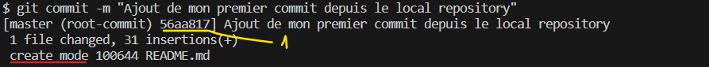

!!! question "Questions"
    1. Que veut dire `1` ?
    2. Ce numéro est-il si court ? Astuce (faites `git log`)

Un `git status` vous permet de constater que votre répertoire de travail est propre.


## II- Zones et cycles de vie des fichiers

!!! question "Questions"
    1. Rappelez les zones de git que vous connaissez ?
    2. Rappelez les commandes pour passez d'une zone à une autre et l'état des fichiers ?

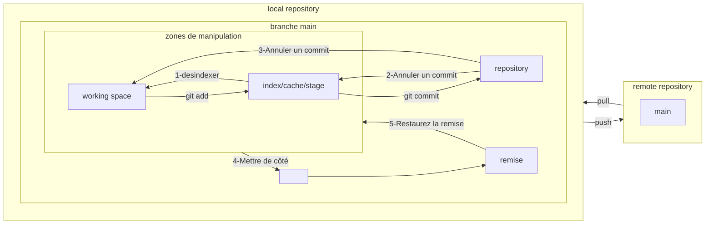
```mermaid
graph RL
    subgraph local[local repository]
        subgraph main[branche main]
            subgraph manipulation[zones de manipulation]
                working[working space]
                index[index/cache/stage]
            end
            repository
            remise
            E[ ]
        end
        working-->|git add|index
        index-->|1-desindexer|working
        index-->|git commit|repository
        repository-->|2-Annuler un commit|index
        repository-->|3-Annuler un commit|working
        manipulation-->|4-Mettre de côté|E
        E-->remise
        remise-->|5-Restaurez la remise|manipulation
        
    end
    subgraph remote[remote repository]
        remote_main[main]
    end
    local-->|push|remote
    remote-->|pull|local
```

!!! question "Questions"
    1. Quelles sont les commandes à utiliser en `1`, `2`, `3`, `4`, `5` ?
    2. Quels sont les espaces que `git stash` sauvegarde ?
    3. Quelles sont les commandes possibles que vous connaissez pour annuler le dernier commit ? Et pour revenir à n'importe quel commit ?
    4. Différence entre `git reset` et `git revert` ?
    5. Différence entre `git rm --cached` et `git restore --staged` ?
    6. Quelle commande utiliserez-vous pour restaurer un fichier dans le `worktree` et le `stage` à son état tel qu'il était trois commits avant le `HEAD`?

    Utiles: <br/>
    :fontawesome-brands-youtube:{ .youtube } [GIT : stash, revert, restore, rebase, reset, cherry-pick](https://www.youtube.com/watch?v=Ayr17xFKMHU&list=PLsm134NGfeYP67pmUoKSWb53lqVqA7oTg&index=3){:target="_blank"} <br/>
    :fontawesome-brands-youtube:{ .youtube } [Zones et cycles de vie des fichiers](https://www.youtube.com/watch?v=VFvu83YaAow&list=PLPoAfTkDs_JbMPY-BXzud0aMhKKhcstRc&index=9){:target="_blank"}

<!--
1- 
(1)  git restore --staged
(2) git reset --soft hash_du_commit
(3) git reset --mixed hash_du_commit ([--soft, --mixed, --hard, --merge])
(4) git stash
(5) git stash pop 

2- `git stash` sauvegarde la zone de travail et la zone d'index.

3-  Pour annuler un dernier commit
    git reset --hard HEAD^
    git revert hash_du_commit
    git commit --amend # Permet de recréer le dernier commit
    git rebase -i # Permet de revenir à n'importe quel commit

4- Différence entre `git reset` et `git revert`

git reset: 
    Réinitialise l'état de votre branche à un commit antérieur.

    Effets
        - Supprime les modifications non commises

        - Modifie l'historique des commits: Le commit HEAD et les commits suivants sont supprimés de l'historique de la branche.

    Utilisation:
        - Annuler des erreurs locales: Utilisé pour annuler des erreurs que vous avez faites dans votre branche locale, comme une mauvaise modification de code.

        - Revenir à un état antérieur: Utilisé pour revenir à un état antérieur de votre branche avant une modification importante.

git revert:
    Crée un nouveau commit qui annule les modifications apportées par un commit antérieur.
    
    Effets: 
        - Crée un nouveau commit qui annule les modifications apportées par un commit antérieur.

    Effets: 
        - Conserve les modifications non commises.

        - Ajoute un nouveau commit

    Utilisation:
        - Annuler des commits publics: Utilisé pour annuler des commits qui ont déjà été poussés vers un dépôt distant, car il ne modifie pas l'historique des commits existants.

        - Collaborer sur des branches: Utilisé pour annuler des modifications dans une branche sans affecter l'historique des commits d'autres contributeurs.

5- Différence entre `git rm --cached` et `git restore --staged`

git rm --cached nom_du_fichier
    # supprime un fichier de l'index. La suppression est propagée vers les dépôts
    # peut être utilisé pour exclure un fichier d'un commit.

git restore --staged nom_du_fichier
    # Désindexe un fichier
    # restore/rétablit un fichier à partir de l'index.
    # n'a aucun effet sur les commits.

6- Quelle commande utiliserez-vous pour restaurer un fichier dans le `worktree` et le `stage` à son état tel qu'il était trois commits avant le `HEAD`?

git restore --source=HEAD~3 --staged --worktree nom_du_fichier
-->


## III- Init Dépôt distant

### Premier commit

La création du dépôt avec un fichier `README.md` initial génère un commit.

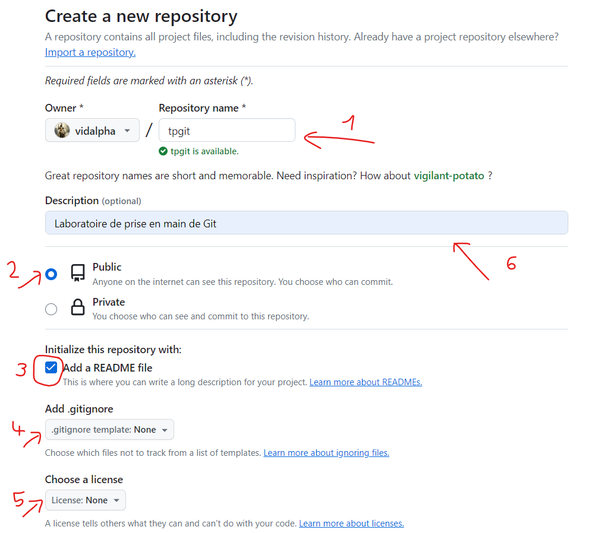

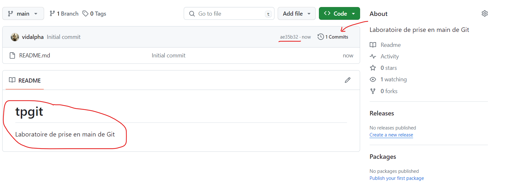

!!! warning
    Remarquez que la description est mise dans le fichier `readme` et qu'un premier commit a été fait sur le remote


### Modification sur le remote

Essayons à présent de modifier le `README.md` en changeant le titre ~~`tpgit`~~

```markdown
# Bienvenu sur mon super blog!
Laboratoire de prise en main de Git
```

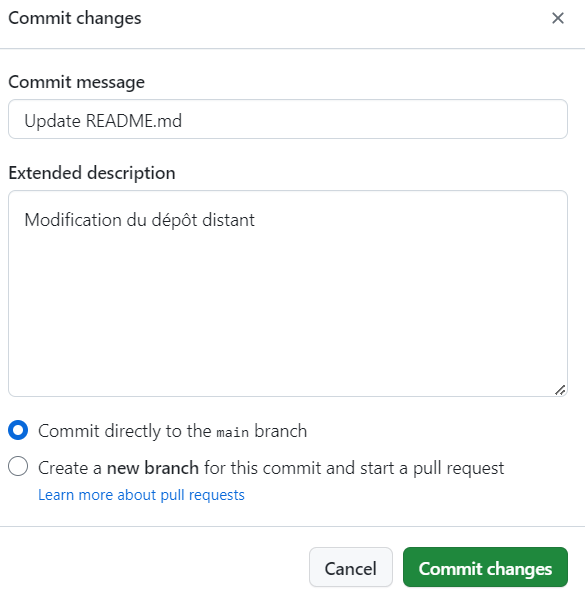{:width="48%"} 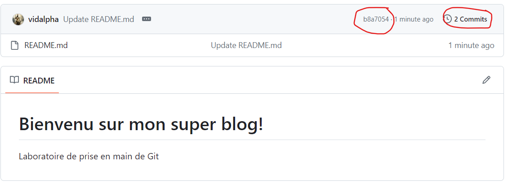{:width="50%"}

!!! warning
    Remarquez que cette modification nécessite un nouveau commit. Le nombre de commit sur le dépôt distant est passé à `2`.

!!! question
    Est-ce le dépôt local et le dépôt distant ont les mêmes historiques de commit ?

## IV- Synchronisation avec le dépôt distant

Pour ce faire nous allons suivre les étapes suivantes: 

### Lier les dépôts local et remote

Pour lier les dépôts local et remote, vous devriez faire la commande `git remote add origin <remote_url>`

``` bash linenums="1"
# Voir la liste actuelle des remotes
git remote -v

# La liste est vide actuellement. 
# Nous allons associé notre dépôt distant
git remote add origin https://github.com/vidalpha/tpgit.git

# Afficher à nouveau les remotes
git remote -v
```
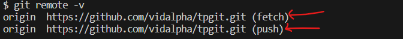

!!! question "Questions"
    1. Que veulent dire les autorisations données sur le dépôt distant (`fetch` et `push`) ?
    2. Connaissez vous la commande `git pull` ? Quel résultat elle produit ?
    3. Quelles sont les deux opérations effectuées par la commande `git pull`?

A la fin de la commande `git remote add origin <remote_url>`, nous arrivons à cette situation:

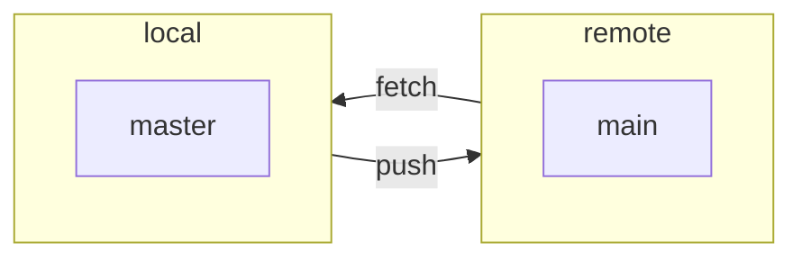
```mermaid
graph RL
    subgraph local
    master
    end
    subgraph remote
    main
    end
    local-->|push|remote
    remote-->|fetch|local
```

Pour autant les deux branches ne sont pas encore liées et sont bien comme ceci:

<table>
<tr>
<td>


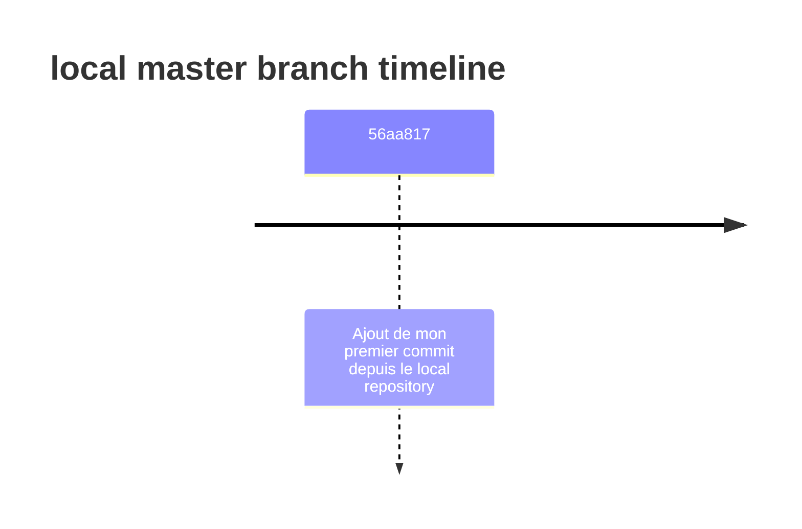
```mermaid
timeline
    title local master branch timeline
    56aa817 : Ajout de mon premier commit depuis le local repository
```

</td>
<td>

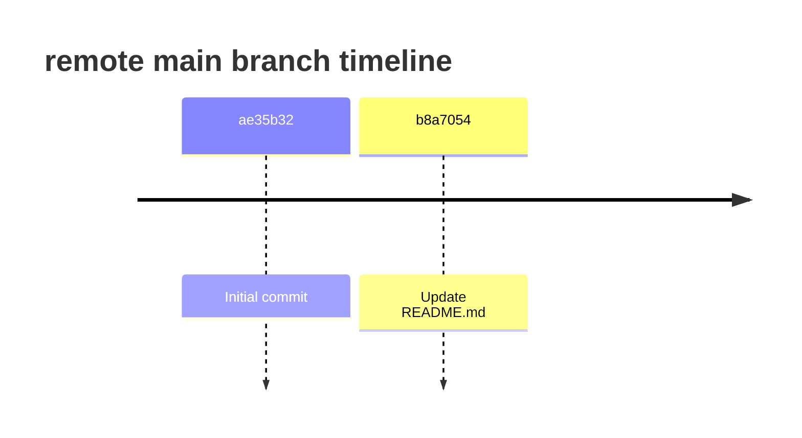
```mermaid
timeline
    title remote main branch timeline
    ae35b32 : Initial commit
    b8a7054 : Update README.md
```


</td>
</tr>

</table>


Pour vous en rendre compte excécuter la commande suivante:

``` bash linenums="1"
# commande simplifiée
# git ls-remote origin

# commande détaillée
git remote show origin
```

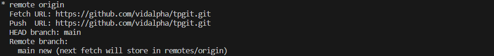

Comme vous le voyez, il n'est dans indiquer la branche qui tracke la branche remote `main`.

Dans la section suivante, nous allons lier la branche locale à la branche distante.

### Lier les branches: locale et distante

Cette liaison est possible grâce à la commande:

```bash linenums="1"
# git branch --set-upstream-to=origin branche_locale 
```

Cependant, elle se met aussi en place automatiquement lors du premier `push` et pour cela, nous devrions utiliser l'option `-u|--set-upstream` pour cette première fois. Les fois prochaines la commande `git push` seule, suffira.

``` bash linenums="1"
# git push -u|--set-upstream origin <branche_locale>
```

!!! question "Questions"
    1. Que se passera t-il après un `push` si on maintient le nom `master`? Astuce (nouvelle branche remote)
    2. Si nous renommions notre branche locale en `main`, la commande `push` échouera. Nous devrions utiliser plutôt dans ce cas-là la commande `pull`. Pourriez-vous expliquer pourquoi ? Astuce (principe entre `pull` et `push`)
    3. A la suite des questions précdentes, le `pull` également échouera. Pourquoi ? Astuce (ancêtre commun absent)

Testons tout ceci.

#### Push command

Nous allons essayer d'envoyer sur le dépôt distant nos modifications.

```bash linenums="1"
git push --set-upstream origin master
```

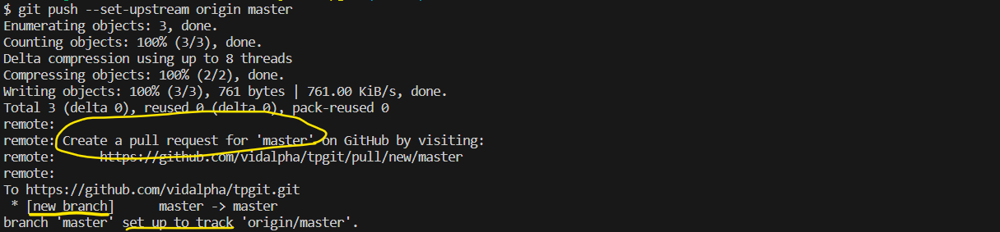


!!! note
    Remarquez sur github qu'une nouvelle branche distante du même nom a été créée. Remarquez aussi que la branche locale `master` traque la nouvelle branche distante `master`.

Pour la suite au lieu de créer une nouvelle branche `master` sur la remote, nous allons plutôt renommer notre branche en local en `main`.

!!! warning
    Avant de continuer supprimer la nouvelle branche distante `master` qui a été créée.

#### Renommer une branche

```bash linenums="1"
# Renomme la branche sur laquelle on se trouve
# git branch -M <nouveau_nom>
git branch -M main
```

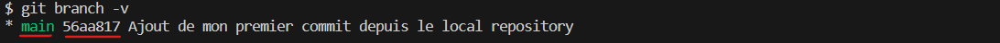


!!! note
    Remarquez que le nom de la branche a bien changé en console

Essayons de faire un `push` avec la branche renommée. Vous remarquerez que le `push` échoue, ce qui est normal.

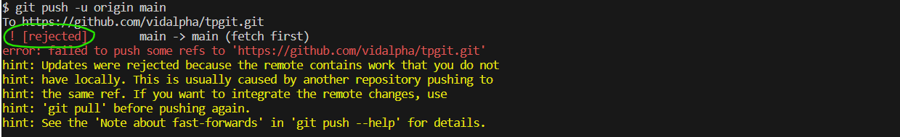

#### Pull command

Et le `pull` ?

```bash linenums="1"
git pull --set-upstream origin main
```

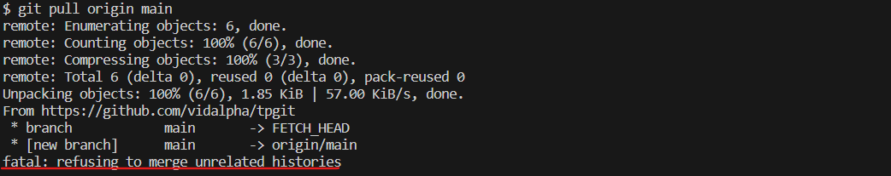

😅 Encore une autre erreur !!!

#### Merge - rebase - squash

Bon! Abordons alors les concepts de `merge`, `rebase` et `squash commit` afin de mieux nous en sortir puisque un certain `merge` a échoué.

!!! info

    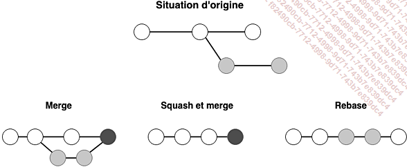

    *Source Livre: Git - Maîtrisez la gestion de vos versions (concepts, utilisation et cas pratiques) (4e édition) de Samuel DAUZON, Editions ENI, 2016*

    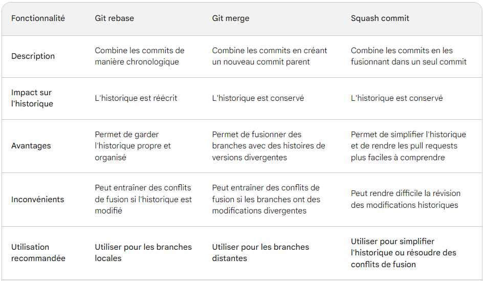


!!! question "Questions"
    1. Pouvez-vous expliquez ce qui s'est produit pour que la fusion des branches distante et locale échoue ? Astuce (:fontawesome-brands-youtube:{ .youtube }[`git merge` Vs `git rebase` Vs `Squash commit`](https://www.youtube.com/watch?v=0chZFIZLR_0){:target="_blank"})
    2. Quel est le comportement par défaut de `git merge` ? Astuce (commit)
    3. Dans quel cas le `git merge` fast-foward produit le même résultat que `git rebase`? Astuce (:fontawesome-brands-youtube:{ .youtube }[`git rebase` Vs `git merge` en pratique](https://www.youtube.com/watch?v=I2NQHB64ol4){:target="_blank"})


Comme vous venez de le comprendre, pour résumer la situation:

- `git merge`: ne peut être utilisé car les branches n'ont pas d'ancêtre commun. C'est pour cela la commande pull a échouée.

- `squash commit` (`git rebase -i ...`): résumera l'historique des commits de la branche distance.

- `git rebase`: nous recréera l'historique. C'est cette option nous allons choisir.

Afin de régler ce problème, nous allons utiliser `git rebase`, une vrai machine à voyager dans le temps. 🚀

!!! info
    La commande `git rebase origin/main` réorganise les commits de la branche actuelle en les replaçant au-dessus des commits de la branche `main`. Cela signifie que les commits de la branche actuelle seront remis à jour pour faire référence aux commits de `main` comme point de départ.


!!! tip "Conseil"
    Que ce soit `git merge <branche_a_integrer>` ou `git rebase <branche_a_integrer>`, il faut se positionner sur la branche source sur laquelle on veut rapatrier la branche à intégrer.


``` bash linenums="1"
# main: le nom de la branche distante
# option -i: pour utiliser rebase en mode interactif
git rebase -i origin/main
```

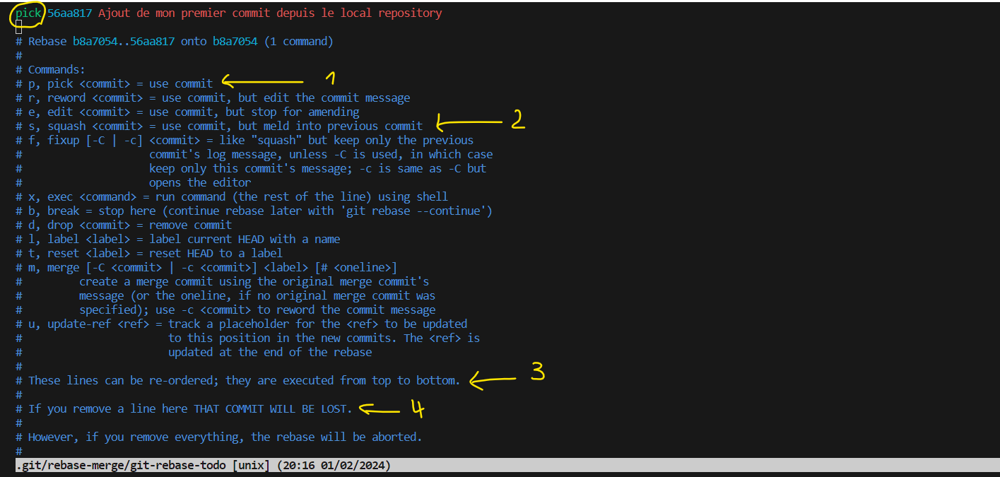


Nous sommes en mode interractif avec l'éditeur `vi` ([Ce lien](https://linux.goffinet.org/administration/traitement-du-texte/editeur-de-texte-vi/){:target="_blank"} peut vous être utile). Pour ceux qui ne vous y connaissez pas suivez mes conseils pour vous en sortir.

!!! question "Questions"

    Commentez les points `1`, `2`, `3` et `4` ?

Mais avant d'aller loin, puisque je sais lire dans l'avenir, je prédis que la commande `rebase` aussi ne marchera pas 😂. Sacré oiseau de mauvaise augure que je suis!!!

Fermons l'éditeur `i` en acceptant le rebase.

```bash linenums="1"
# Appuyez sur la touch `echap` d'abord
:q!
```

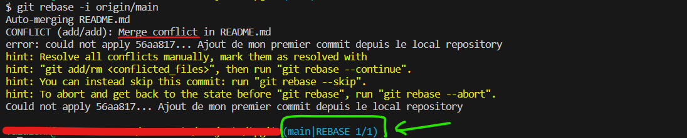

!!! question "Questions"

    1. Pourquoi le `rebase` n'a pas marché ?
    2. Commentez les `hints` en jaune ?

!!! note
    Remarquez dans la zone en vert en bas dans la console que la stratégie `rebase` est toujours en cours ?

#### Gestion des conflits

Un conflit Git survient lorsque deux branches ou commits modifient les mêmes parties d'un même fichier de manière incompatible. Dans cette section, nous allons apprendre à résoudre les conflits.

##### Structure d'un conflit

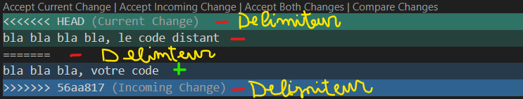


**Revenons à VS Code**

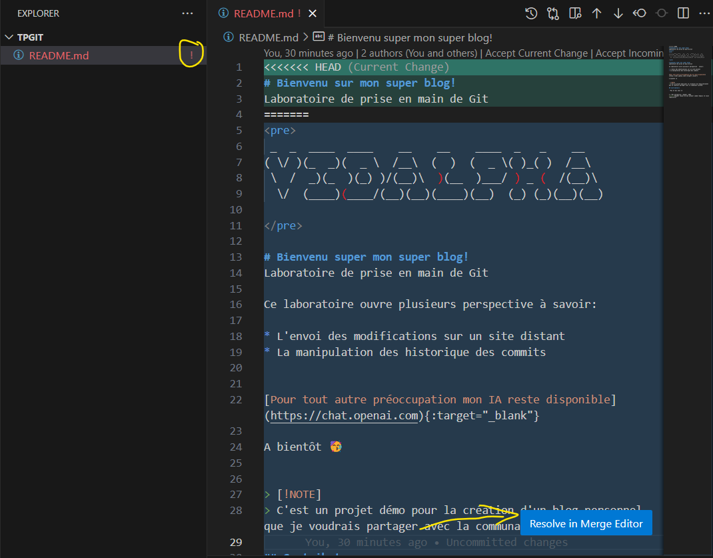

##### Resolve in merge editor

Suivez les instructions dans `VS Code` pour terminer.

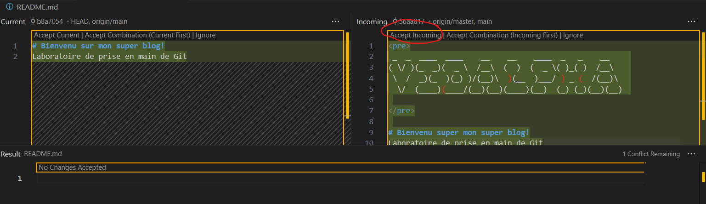


!!! abstract "Résumé"

    1. Vous gardez la zone que vous voulez
    2. Vous enlevez la zone que vous ne voulez pas
    3. Ne jamais oublier d'enlever les ~~délimiteurs~~ sinon ils seront commités

!!! warning "Ne jamais oublier"

    Après la résolution d'un conflit, un ``commit` nécessaire pour prendre en compte les modification.
    
Nous venons de résoudre le `conflit` nous allons alors faire un `commit`.

```bash linenums="1"
git add README.md
git commit -m "Résolution du conflit sur le fichier README.md"
```

!!! example "Exercice"

    [Pratiquer la résolution des conflits ...](https://github.com/skills/resolve-merge-conflicts){:target="_blank"}

#### Finalisation du rebase

A présent nous allons continuer notre `rebase`.

```bash linenums="1"
git status # Avec `git status`, vous aurez le résumé de notre situation actuelle.
git rebase --continue
```
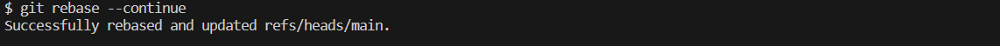


Cette dernière commande met fin à notre aventure de récupérer les changements provenant du `remote`. Avant d'envoyer nos modifications en ligne, apprécions l'historique des commits après le `rebase`.


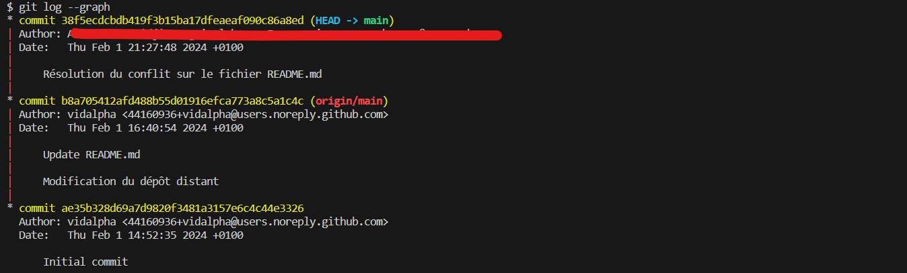

!!! question "Questions"

    1. Quels constats faites-vous par rapport à l'ordre des commits dans l'historique?
    2. Est ce que les hashs des commits sont maintenus ?
    3. Le fichier `README.md` est-il bien présent dans votre espace de travail? Que donne la commande `git status`?

Bon voilà, vous êtes un(e) pro de fusions de branches et d'historiques 🤓. Nous pouvons envoyez nos modifications en ligne.


#### Envoi des modifications sur le dépôt distant

```bash linenums="1"
git push -u origin main
```
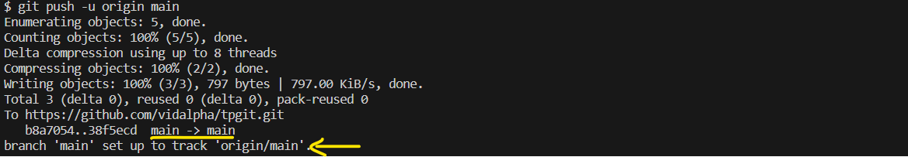


Nous pouvons aussi utiliser la commande `git remote show origin` pour nous assurer que tout ok et que la branche locale `main` trackée bien la branche distante `main`.

```bash linenums="1"
git remote show origin
```

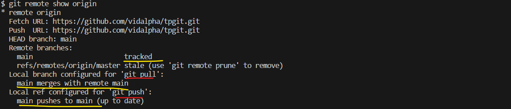


### Résumé des commandes de base

Nous avions pris un long chemin afin d'aborder des concepts plus ou moins avancés, mais la procédure de récupération et d'envoi en ligne de vos modifications n'est pas si compliquée.

> Et puis qui peut le plus, peut le moins dit-on? 😜

#### Cloner un dépôt

Pour les commandes suivantes, créer un autre répertoire

```bash linenums="1" hl_lines="2"
# Allez sur github, récupérer l'URL du dépôt et sur votre machine, faite
git clone https://github.com/vidalpha/tpgit.git
# Ajoutez vos modifications
# Indexez les fichiers
git add -A
# Faites un commit
git commit -m "Mon premier commit"
# Faites un push
git push -u origin master


# Les prochaines fois si vous travaillez en collaboration.
# Ajoutez vos modifications
# Indexez les fichiers
git add -A
# Faites un commit
git commit -m "Mon premier commit"
# Mettez-vous à jour par rapport au serveur
git pull
# Envoyez vos modifications
git push
```

A ce stade, voici la structure de nos branches locale et remote

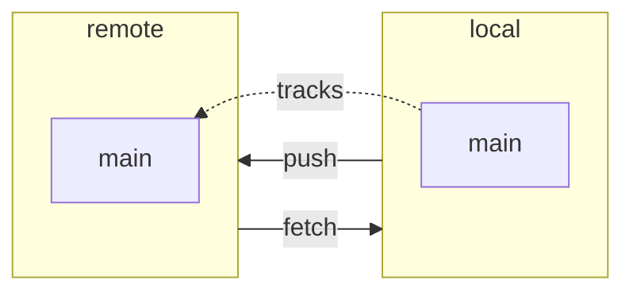
```mermaid
graph RL
    subgraph local
    local_main[main]
    end
    subgraph remote
    remote_main[main]
    end
    local-->|push|remote
    remote-->|fetch|local
    local_main-.tracks.-> remote_main
```

## V- Gitignore

Dans cette section nous allons apprendre à ignorer des fichiers ou répertoires sensibles. Afin que `git` tienne compte des fichiers ou répertoires à ignorer, nous allons mettre le nom de ces fichiers/dossiers dans un fichier particulier `.gitignore`

1) Créer le fichier `secret.yml` avec ce contenu:

Vous mettrez vos supers fake `username` et `password`.

```yml
git_credentials:
    username: bonbolibo
    password: tunetrouveraspas
``` 

!!! danger
    Ne mettez pas vos informations sensibles ou vos crédentials git. Ce n'est juste qu'un exemple pour la suite.

!!! question
    Après avoir ajouté le fichier `secret.yml`, lancez la commande `git status`. Commentez ce que vous voyez ?

2) Ajouter le fichier `.gitignore`

3) Dans le fichier `.gitignore`, mettez `secret.yml` et enregistrer

4) Faites à nouveau `git status`. Que remarquez vous ?

5) Envoyez la modification en ligne avec le message de commit `Ajout du fichier .gitignore`

!!! question
    Le fichier `secret.yml` est-il présent sur le dépôt distant ?


## VI- Développements parallèles

Les branches sont très utiles pour exploirer des pistes de fonctionnalités sans perturber la branche principale (dans notre cas il s'agit de `main`). Les modifications sur la branche auxilliaire pourront être fusionnées avec la branche principale.

C'est ce que nous allons essayer dans cette section.

**Tâches**

1) Apportez quelques modifications au fichier `README.md`

``` markdown linenums="1"

<pre>
 _  _  ____  ____    __    __    ____  _   _    __     
( \/ )(_  _)(  _ \  /__\  (  )  (  _ \( )_( )  /__\    
 \  /  _)(_  )(_) )/(__)\  )(__  )___/ ) _ (  /(__)\   
  \/  (____)(____/(__)(__)(____)(__)  (_) (_)(__)(__)  

</pre>

# Bienvenu sur mon super blog!

## Mes tutoriels

1. Intégrer des graphes avec mermaid
2. Mettre en place la documentation d'un projet avec mkdocs

> [!NOTE]
> C'est un projet démo pour la création d'un blog personnel que je voudrais partager avec la communauté github.

## Contributeurs

- Moi et moi seul 🤓

[Pour tout autre préoccupation mon IA reste disponible](https://chat.openai.com)

A bientôt 🥳


## Copyright


© < Mon entreprise > Unamur, 2024

```

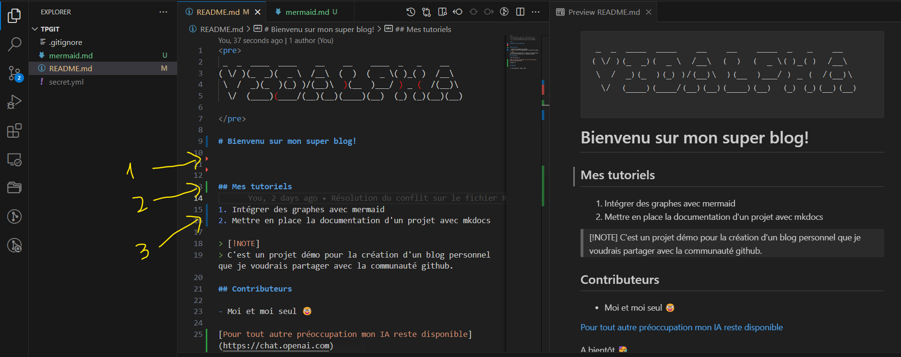

!!! question "Question"
    Que veulent dire ces indications (`1`, `2` et `3`) de `VS code` ?


### Basculer vers une nouvelle branche

```bash linenums="1"
# Voir la liste des branches
# git branch

# Créer une nouvelle branche
# git branch ma_nouvelle_branche

# Supprimer une branche
# git  branch -d nom_de_la_branche

# Basculer sur une autre branche
# (switch à partir de la version 2.23)
# git checkout|switch  branche_apres_switch

# Créer une branche et basculer dessus automatiquement
git checkout -b mermaid

# Voir la branche sur laquelle on se trouve. Il y a une `*` devant la branche active
git branch --all
```

!!! question "Questions"

    1. Comparez l'état des area dans `main` et `mermaid` ?
    2. Qu'est-ce que vous remarquez sur github quant aux branches créées localement? A quel moment ces branches sont visibles en ligne ?

!!! warning "Précautions avant basculement"
    L'exemple précédent prouve que vous ne devriez pas avoir de modifications en cours lors du switch vers une autre branche. Gardez votre branche `clean` avant de basculer vers une autre.

2) Vous êtes sur la branche `mermaid`. Créer un nouveau fichier `mermaid.md` avec ce contenu.

```markdown linenums="1"
# Un markdown de ouf!!! avec Mermaid 🤓

Apprendre à faire tout plein de chose comme:

## Flowchart

## Sequence diagram

## Gantt chart

## Class diagram

## State diagram
```


3) Faites un commit

```bash linenums="1"
git add -A
git commit -m "Ajout de mermaid.md"

# Faites `git status` pour vérifier si le répertoire est clean après le commit
```

### Message du dernier commit

4) Modifier le message du commit dernier pour préciser que la page d'acceuil a aussi été mis à jour. 

```bash linenums="1"
git commit --amend -m "Structuration de mon blog et ajout de la page mermaid.md"
```

5) Ajouter un lien vers `mermaid.md` dans le fichier `README.md` et faites un commit

``` markdown linenums="1" hl_lines="13"

<pre>
 _  _  ____  ____    __    __    ____  _   _    __     
( \/ )(_  _)(  _ \  /__\  (  )  (  _ \( )_( )  /__\    
 \  /  _)(_  )(_) )/(__)\  )(__  )___/ ) _ (  /(__)\   
  \/  (____)(____/(__)(__)(____)(__)  (_) (_)(__)(__)  

</pre>

# Bienvenu sur mon super blog!

## Mes tutoriels

1. [Intégrer des graphes avec mermaid](./mermaid.md)
2. Mettre en place la documentation d'un projet avec mkdocs

....

```

```bash linenums="1"
git commit -m "Lien de README.md vers mermaid.md"
```


6) Sur la branche `main`, ajouter une image ([le logo de l'UNamur](../../ressources/UNamur.png)) dans le fichier `README.md` et faites un commit.

``` markdown linenums="1" hl_lines="7"

.....

## Contributeurs

- Moi et moi seul 🤓


© < Mon entreprise > Unamur, 2024

```

```bash linenums="1"
git commit -m "Ajout de l'image de l'université"
```

L'historique des commits sur les deux branches se présente comme suit:

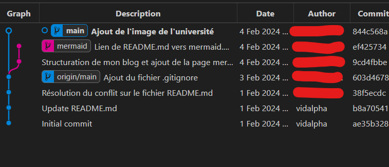


### Merge de branches

La branche `mermaid` nous a permis de faire développer la page `mermaid.md`. Elle est maintenant stable. Nous allons la fusionner avec la branche main.

Pour ce faire positionnez-vous sur la branche `main` et faites. Réglez les éventuels conflits qui se poseraient

```bash linenums="1"
git merge mermaid
```

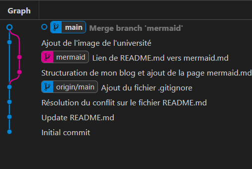

!!! question "Questions"

    1. Faites un push sur le dépôt distant à partir de la branche `main`. La branche `mermaid` est-elle présente sur le dépôt distant ? Sinon comment pouvez-vous envoyer votre branche locale `mermaid` en ligne afin de permettre aux autres utilisateurs du dépôt de travailler dessus.
    2. Que fait la commande `git cherry-pick` ?
    3. Différence entre `git cherry-pick` et `git merge` ?

<!--

1- `git cherry-pick`: 
    Cette commande permet d'appliquer un commit contenu dans une branche A dans une branche B sans pour autant importer toutes les modifications de la branche A (ce que fait un merge)


2- Différence entre `git cherry-pick` et `git merge` ?

`git cherry-pick`: restaure un 

-->

### Les tags

Un tag est un alias (un nom) défini par un développeur dont le rôle est de pointé sur un commit. Les tags sont utilisés pour marquer les [numéros de version](../../frameworks/git/index.md#le-versioning) sur les commits.

Git supportes deux types de tag:

- Les tags annotés: `git tag -a <tagname>`<br>
    stockent le nom du tag sur un commit donné
- Les tags légers: `git tag <tagname>`<br>
    stockent davantage d'informations en conservant également la date de création et le créateur du tag.

Nous allons ajouter le `tag` `v1.0.0` au commit du merge.

```bash linenums="1"
# Afficher la liste des tags
# git tag --list

# Ajouter un tag à un commit
git tag v1.0.0 <hash_commit>
```

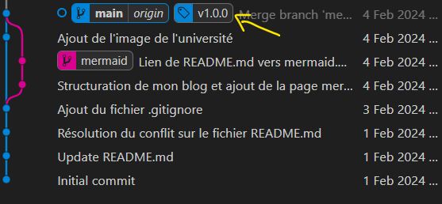

!!! question "Questions"

    1. Affichez les détails du tag avec la commande `git show v1.0.0` ?
    2. Comment pouvons nous envoyer les tags sur le dépôt distant ?

```bash linenums="1"
# Publier tous les tags sur le dépôt distant
# git push origin --tags

# Publier un tag en particulier
git push origin v1.0.0
```
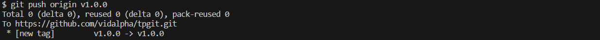

!!! question "Questions"

    1. Voir dans le dépôt distant si le `tag` est bien présent ?

## VII- Faire du nettoyage

Dans cette section nous allons apprendre à faire de la maintenance de git.

#### git prune

Pour supprimer les références locales des branches distantes qui n'existent plus sur le dépôt distant.

!!! info
    Voici comment fonctionne `git remote prune` :

    1. Il contacte le dépôt distant spécifié par le nom (par exemple, `origin`) et récupère la liste des branches disponibles.
    2. Il compare la liste des branches distantes avec la liste des branches locales sur votre ordinateur.
    3. Pour chaque branche distante qui n'existe plus sur le dépôt distant, `git remote prune` la supprime de votre liste de branches locales.

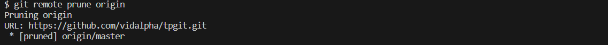


#### Git garbage collection

!!! info
    `git gc` est utilisée pour récupérer de l'espace disque et améliorer les performances de votre dépôt Git. Elle fonctionne en supprimant les objets inutiles de votre dépôt local, tels que :

    - **Objets non compressés:** Ce sont des fichiers individuels qui stockent le contenu des objets Git (blobs, arbres, commits, etc.) avant qu'ils ne soient compressés dans des fichiers compressés.
    - **Chaînes de deltas packagés:** Ce sont des chaînes de deltas (différences) entre les révisions Git qui sont utilisées pour stocker les objets plus efficacement dans les fichiers packagés.
    - **Objets inaccessibles:** Ce sont des objets qui ne sont plus référencés par aucun autre objet de votre dépôt et qui peuvent être supprimés en toute sécurité.

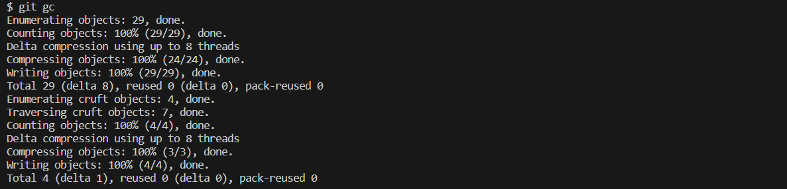


## VIII- Collaboration

### Issues

Sur le dépôt distant, créer un `issue` (problème).

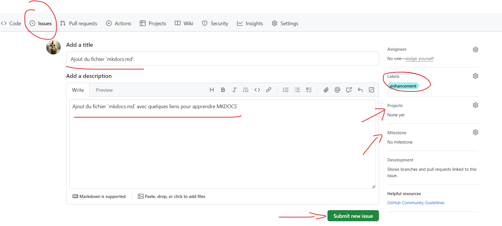

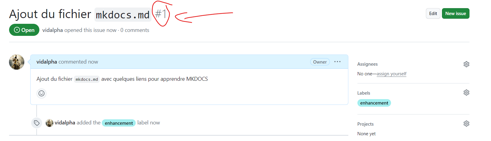

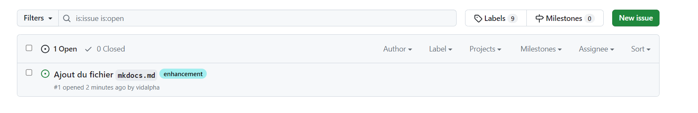

!!! question "Question"
    Comment faire un commit pour satisfaire cet `issue` ? Astuce ( Closes #1)

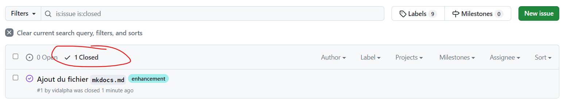


### Fork

Un `fork` est une copie d'un dépôt. La création d'un `fork` vous permet d'expérimenter librement des modifications sans affecter le projet d'origine.

Un fork vous permet de :

- Travailler sur une version indépendante du code source d'un projet.
- Proposer des modifications au projet original. Vous ne pouvez pas modifier directement le code du dépôt original. Vous devez créer une `pull request`
- Collaborer avec d'autres utilisateurs sur le code.

!!! warning
    Il est important de noter que les forks ne sont pas des copies permanentes du dépôt original.


**Exercice**

Faire le fork du [projet mermaid](https://github.com/mermaid-js/mermaid){:target="_blank"}

#### Avant un fork

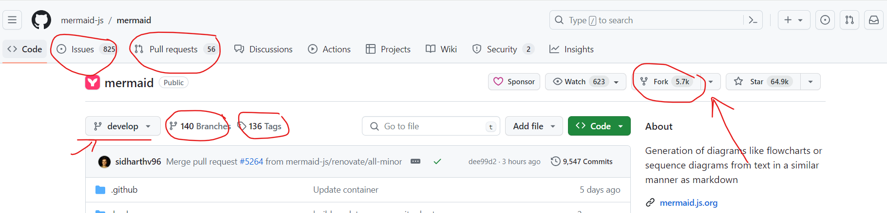

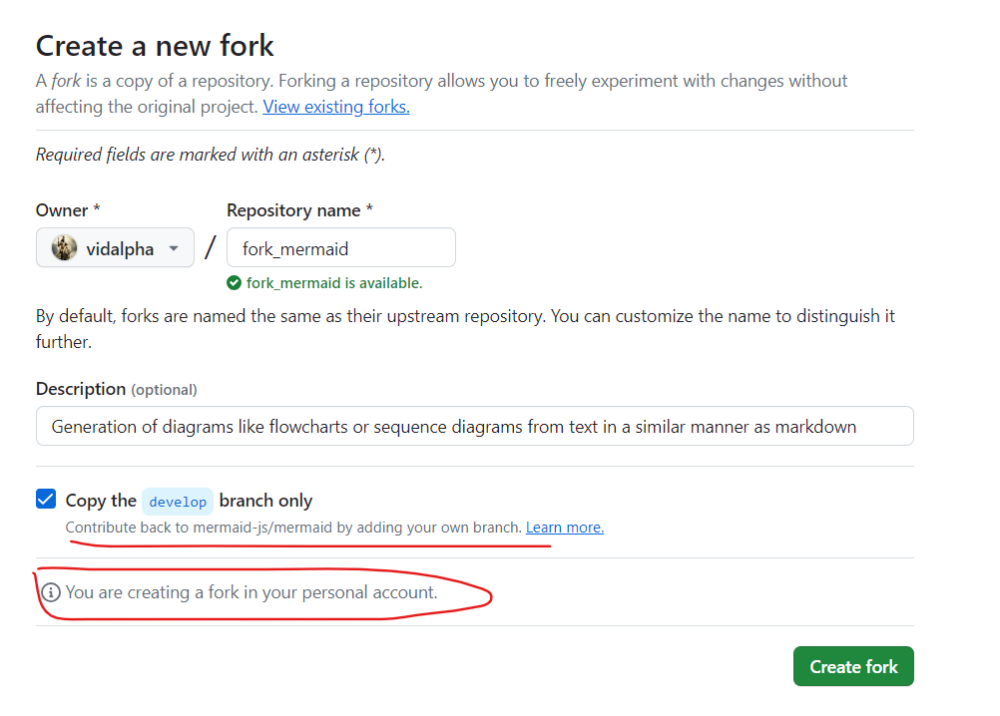

#### Après un fork

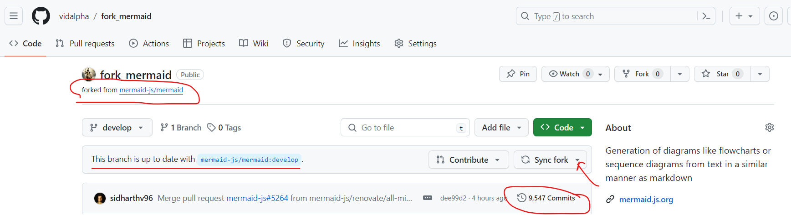


!!! question "Questions"
    1. Quelle est la visibilité d'un fork par défaut ? (privé ou public) ?
    2. Si le propriétaire du dépôt original supprime son dépôt, qu'en sera t-il des forks ?

### Pull Request (PR)

Une `pull request (PR)`, ou `demande de tirage` en français, est un moyen de proposer des modifications à un dépôt Git distant. Elle permet de soumettre vos changements à un responsable de projet pour qu'il les examine et les intègre dans le code principal.

!!! info
    📄 [Créer un pull request](https://docs.github.com/fr/pull-requests/collaborating-with-pull-requests/proposing-changes-to-your-work-with-pull-requests/creating-a-pull-request){:target="_blank"}

    📄 [Créer un pull request à partir d'un `Fork`](https://docs.github.com/fr/pull-requests/collaborating-with-pull-requests/proposing-changes-to-your-work-with-pull-requests/creating-a-pull-request-from-a-fork`){:target="_blank"}

    :fontawesome-brands-youtube:{ .youtube } [Short video](https://www.youtube.com/watch?v=jRLGobWwA3Y){:target="_blank"}


!!! example "Exercice"
    [S'exercer avec les `pull requests` ...](https://github.com/skills/review-pull-requests){:target="_blank"}


**Zone d'approbation d'une pull request**

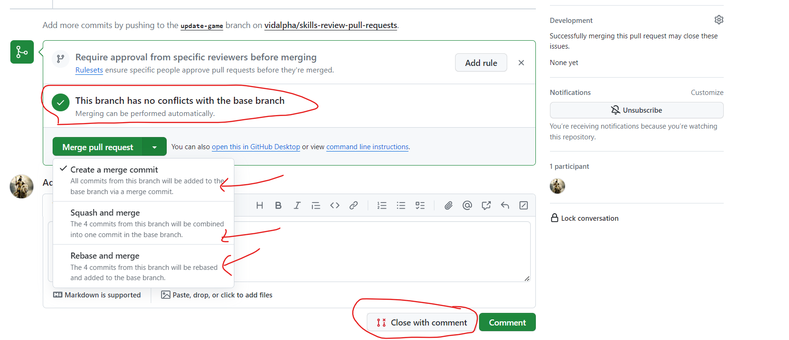


!!! question "Question"
    1. Commentez les zones mis en évidence ?
    2. Quelles sont les commandes internes effectuées par un `merge commit` lors d'un `pull request` ?
    
    

<!--
Quelles sont les commandes internes effectuées par un `merge commit` lors d'un `pull request` ?

- git fetch :Cette commande récupère les dernières modifications du dépôt distant.

- git checkout: Cette commande change la branche active vers la branche principale du dépôt local.

- git merge (résolution des conflits de fusion si nécessaire): Cette commande fusionne la branche de la pull request dans la branche principale.

- git add
- git commit
- git push

-->


