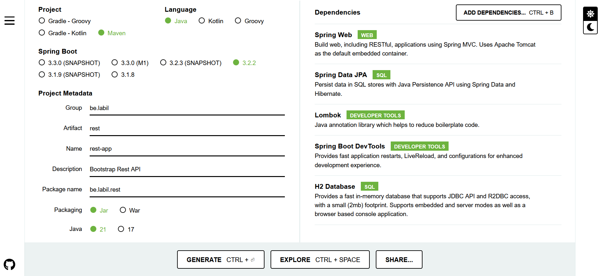
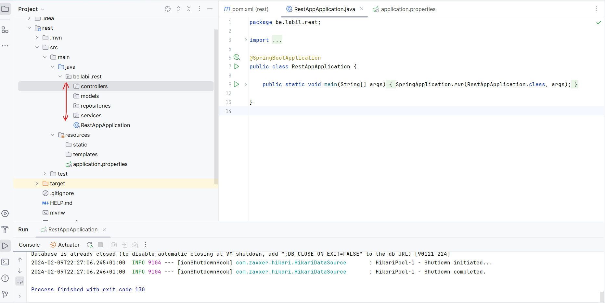
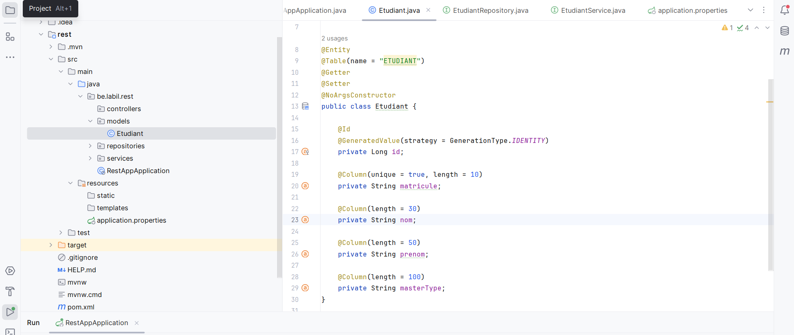
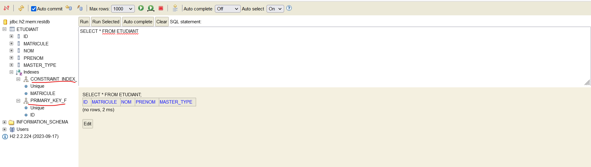
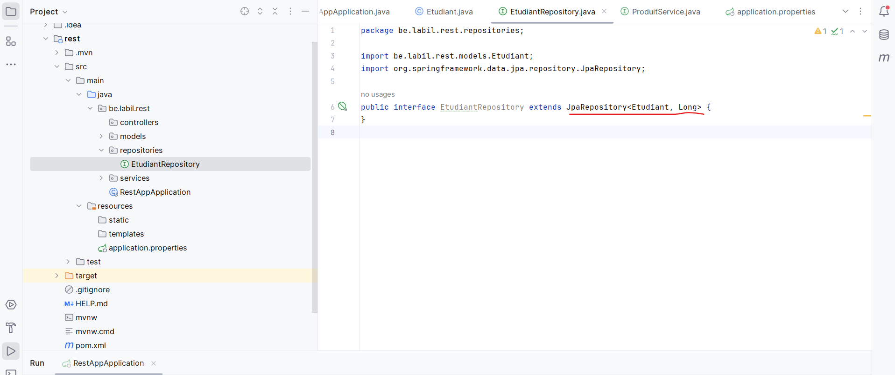
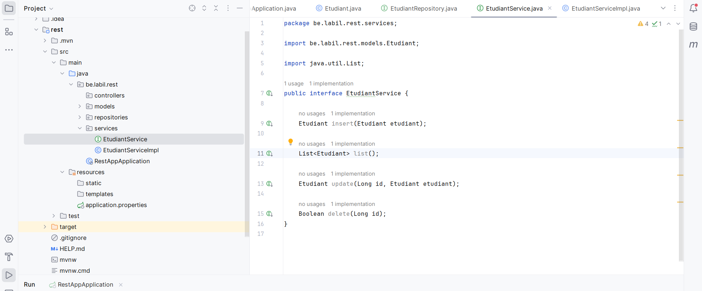
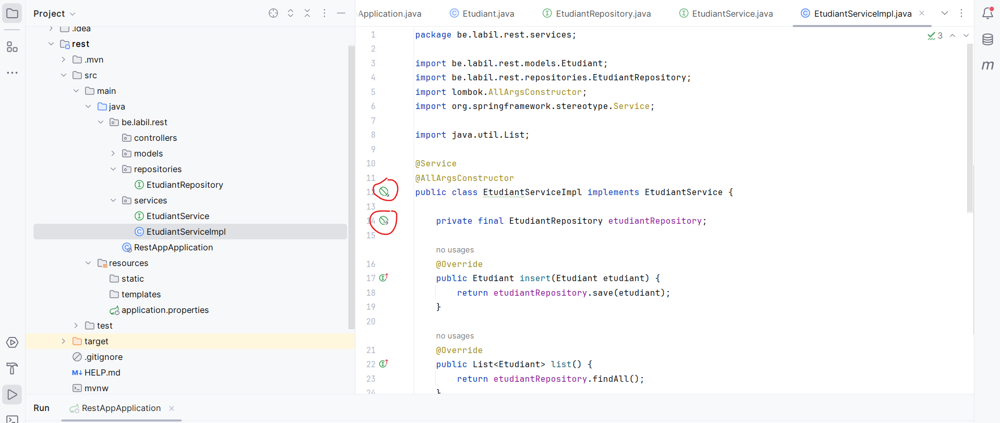
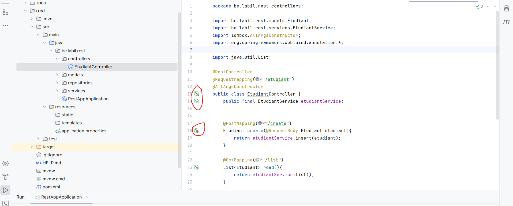
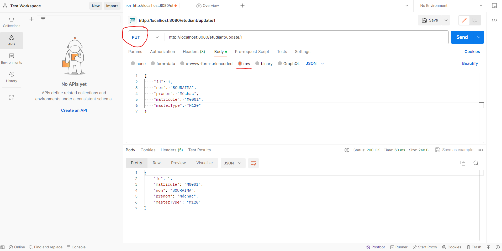
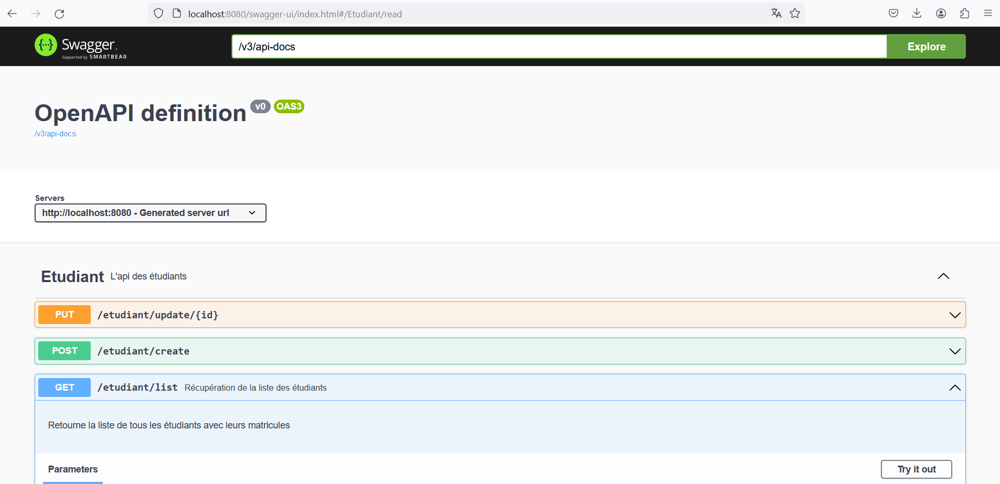

# TP 3: BOOTSTRAP REST APP

**Objectif:** Tu seras capable à la fin de ce TP de fournir  des REST API avec SpringBoot

**Mots clés**

- REST API
- Spring Data JPA
- Spring Web
- LomBok
- H2
- Swagger


**Ressources**

[Code source du TP](../../ressources/rest.zip)


!!! question "Questions"
    Qu'est ce qu'une API RESTful ?

## Ajout des dépendances



1. Après avoir choisi les dépendances, générez le projet.
2. Ouvrez le projet avec votre IDE et spécifier la version de Java à utiliser.

## Stucturation du projet



## Connexion à  H2

[Voir cette rubrique](../../frameworks/spring/db_confs.md#h2)

## Persistence de données



Vérifiez la persistence en base de données




## Création de repository



## Création de service

Dans cette section, nous allons créer un service et son implémentation.




Une implémentation du service avec l'injection de dépendance (`EtudiantRepository`)



!!! question "Questions"
    `EtudiantRepository` est une interface. Quelle implémentation est fournie ?

## Mise en place du controller



!!! question "Questions"

    1. Quelle est la différence entre `PUT` et `PATCH` ?
    2. Dans notre controlleur, les modèles sont exposés dans le controller. Une bonne pratique consiste à utiliser les `DTO (Data Transfer Object)`. Quels sont leurs utilités ?
    3. Connaissez-vous `GraphQL` ? Quel est son fonctionnement ?

## Tests fonctionnels



## Documentation de l'API (Swagger)

### Ajout de la dépendance de Swagger 3

Ajoutez la dépendance de Swagger dans le fichier `pom.xml`

```xml linenums="1" hl_lines="51-57"
<?xml version="1.0" encoding="UTF-8"?>
<project xmlns="http://maven.apache.org/POM/4.0.0" xmlns:xsi="http://www.w3.org/2001/XMLSchema-instance"
		 xsi:schemaLocation="http://maven.apache.org/POM/4.0.0 https://maven.apache.org/xsd/maven-4.0.0.xsd">
	<modelVersion>4.0.0</modelVersion>
	<parent>
		<groupId>org.springframework.boot</groupId>
		<artifactId>spring-boot-starter-parent</artifactId>
		<version>3.2.2</version>
		<relativePath/> <!-- lookup parent from repository -->
	</parent>
	<groupId>be.labil</groupId>
	<artifactId>rest</artifactId>
	<version>0.0.1-SNAPSHOT</version>
	<name>rest-app</name>
	<description>Bootstrap Rest API</description>
	<properties>
		<java.version>21</java.version>
	</properties>
	<dependencies>
		<dependency>
			<groupId>org.springframework.boot</groupId>
			<artifactId>spring-boot-starter-data-jpa</artifactId>
		</dependency>
		<dependency>
			<groupId>org.springframework.boot</groupId>
			<artifactId>spring-boot-starter-web</artifactId>
		</dependency>

		<dependency>
			<groupId>org.springframework.boot</groupId>
			<artifactId>spring-boot-devtools</artifactId>
			<scope>runtime</scope>
			<optional>true</optional>
		</dependency>
		<dependency>
			<groupId>com.h2database</groupId>
			<artifactId>h2</artifactId>
			<scope>runtime</scope>
		</dependency>
		<dependency>
			<groupId>org.projectlombok</groupId>
			<artifactId>lombok</artifactId>
			<optional>true</optional>
		</dependency>
		<dependency>
			<groupId>org.springframework.boot</groupId>
			<artifactId>spring-boot-starter-test</artifactId>
			<scope>test</scope>
		</dependency>

		<!-- Swagger dependencies -->
		<dependency>
			<groupId>org.springdoc</groupId>
			<artifactId>springdoc-openapi-starter-webmvc-ui</artifactId>
			<version>2.0.2</version>
		</dependency>
		<!-- Swagger dependencies -->

	</dependencies>

	<build>
		<plugins>
			<plugin>
				<groupId>org.springframework.boot</groupId>
				<artifactId>spring-boot-maven-plugin</artifactId>
				<configuration>
					<excludes>
						<exclude>
							<groupId>org.projectlombok</groupId>
							<artifactId>lombok</artifactId>
						</exclude>
					</excludes>
				</configuration>
			</plugin>
		</plugins>
	</build>

</project>
```

Pour `Spring Boot 3`, c'est la seule configuration à faire afin de permettre `Swagger 3`

L'UI Swagger est alors disponible à l'adresse [`http://localhost:8080/swagger-ui/index.html`](http://localhost:8080/swagger-ui/index.html){:target="_blank"}

Le format JSON est disponible à l'adresse [`http://localhost:8080/v3/api-docs`](http://localhost:8080/v3/api-docs){:target="_blank"}

Nous pouvons ensuite faire quelques ajustements dans les controlleurs afin de fournir plus de description.

```java linenums="1" hl_lines="3 16-21"
//...

@Tag(name = "Etudiant", description = "L'api des étudiants")
@RestController
@RequestMapping("/etudiant")
@AllArgsConstructor
public class EtudiantController {
    public final EtudiantService etudiantService;


    @PostMapping("/create")
    Etudiant create(@RequestBody Etudiant etudiant){
        return etudiantService.insert(etudiant);
    }

    @Operation(
            summary = "Récupération de la liste des étudiants",
            description = "Retourne la liste de tous les étudiants avec leurs matricules")
    @ApiResponses(value = {
            @ApiResponse(responseCode = "200", description = "Opération réussie")
    })
    @GetMapping("/list")
    List<Etudiant> read(){
        return etudiantService.list();
    }

//...
```




### Liens utiles pour Swagger

- 📄 [Swagger 3 et SpringBoot 3](https://medium.com/@f.s.a.kuzman/using-swagger-3-in-spring-boot-3-c11a483ea6dc){:target="_blank"}

- 📄 [Spring Boot + Swagger 3 example (with OpenAPI 3)](https://www.bezkoder.com/spring-boot-swagger-3/){:target="_blank"}