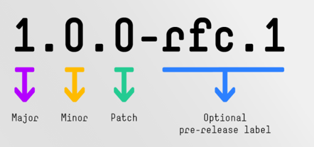
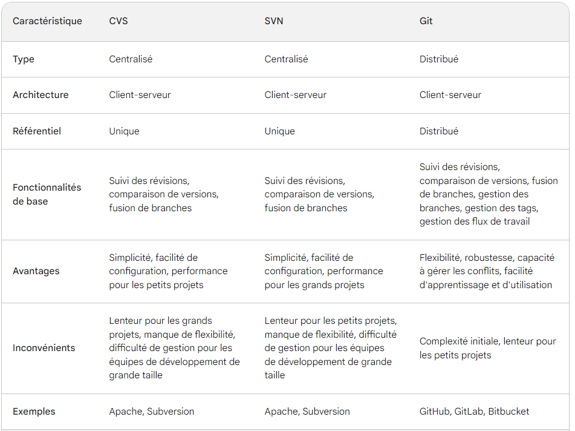
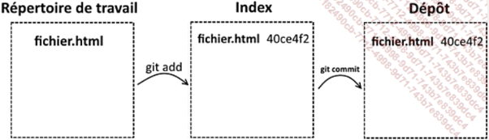
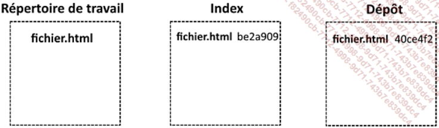
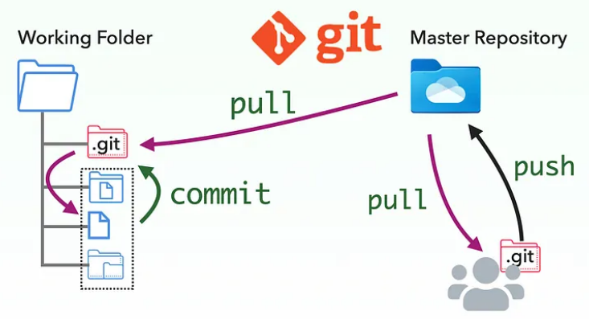
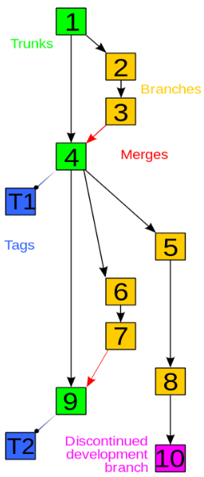
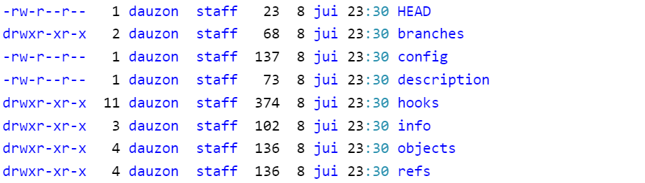
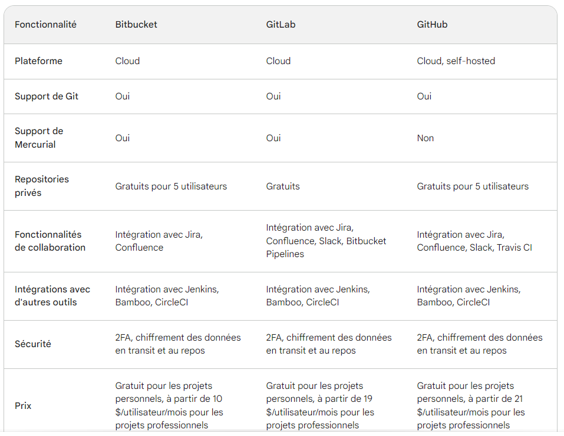

# Collaborer sur un projet 🤯

## Le versioning

Le versioning en informatique fait référence à la gestion des différentes versions d'un logiciel, d'un fichier, d'une base de données ou d'autres éléments de données. Cela permet de:

{:width="45%" align=right}


- Faire le suivi des modifications apportées à ces éléments
    - Contrôle
    - Cohérence
    - Traçabilité ou historique;
- Restaurer les éléments;
- Développements parallèles;
- Organiser les éléments;

*L'image à droite est celle du système SemVer (pour Semantic Versioning)*

### Les outils existants

Outils de versioning qui existent: Subversion (SVN), Mercurial, **Git**, …

*NB: Apache Subversion (SVN) sorti en 2004 est apprécié par les informaticiens travaillant sur des projets nécessitant plus de confidentialité. En effet, il permet de travailler sur une partie précise d’un projet en limitant les accès à l’intégralité du code source.*

### Pourquoi Git ?

Pourquoi Git malgré l'existence d'autres outils de versioning...




:fontawesome-brands-youtube:{ .youtube } [Comprendre GIT en 5 minutes](https://www.youtube.com/watch?v=gGKZLfPYORs&list=PLsm134NGfeYP67pmUoKSWb53lqVqA7oTg&index=3){:target="_blank"}

Git a été développé par Linus Torvalds et publié en tant que projet open source sous une licence libre, en 2005. Les atouts de Git:

- **Distribution décentralisée**: Git est un système de gestion de versions décentralisé, ce qui signifie que chaque utilisateur dispose de sa propre copie complète du référentiel.

- **Collaboration**

- **Vitesse**: conçu pour être efficace et effectue de nombreuses opérations en local, sans nécessiter de communication avec un serveur distant.

- **Gestion efficace des branches**

- **Écosystème riche**: Git dispose d'un écosystème riche en outils et services tiers. Des plates-formes telles que GitHub, GitLab et Bitbucket offrent des services d'hébergement de référentiels Git, de suivi des problèmes, de gestion de projets, de collaboration et d'intégration continue. Ces outils facilitent la collaboration et l'automatisation des workflows de développement.

- **Sécurité et intégrité**: Chaque révision est identifiée par une empreinte cryptographique, ce qui garantit que les données ne sont pas altérées….

## Concepts de base git

1) **Repository**: Les fichiers versionnés (suivis, traqués…) sont conservés dans un dépôt. Ce dépôt contient les fichiers, les historiques et la configuration de git

2) **Les trois états des fichiers dans git**: 

- Working directory (espace de travail)

- Stage area – pre commit holding area (Zone de stockage intermédiaire)

- Commit – Git repository (History) Le référenciel git ou historique de validation


{:width="80%"}

Que se passe t-il lorsque le développeur modifie le fichier, l’ajoute à l’index mais ne fais pas un commit?

{:width="80%"}

Le fichier se retrouve donc dans un état distinct entre l’index et le dépôt, ce qui est à l’origine des deux identifiants différents.

:fontawesome-brands-youtube:{ .youtube } [Zones et cycles de vie des fichiers](https://www.youtube.com/watch?v=VFvu83YaAow&list=PLPoAfTkDs_JbMPY-BXzud0aMhKKhcstRc&index=9){:target="_blank"}

:fontawesome-brands-youtube:{ .youtube } [Mettre de côté un travail en cours (et le reprendre plus tard) git stash](https://www.youtube.com/watch?v=Db8FoRAx87U&list=PLPoAfTkDs_JbMPY-BXzud0aMhKKhcstRc&index=10){:target="_blank"}

3) **Remote repository**

4) **Branch**

## Workflows

{:width="60%" align=left}
{:width="30%"}

## Installation et configuration

:fontawesome-brands-youtube:{ .youtube } [Installation sur Windows](https://www.youtube.com/watch?v=G0UV0jKgV4Y&list=PLjwdMgw5TTLXuY5i7RW0QqGdW0NZntqiP&index=3){:target="_blank"}

:fontawesome-brands-youtube:{ .youtube } [Installation sur Linux](https://www.youtube.com/watch?v=vhkTbrJfqKE&list=PLjwdMgw5TTLXuY5i7RW0QqGdW0NZntqiP&index=4){:target="_blank"}

:fontawesome-brands-youtube:{ .youtube } [Installation sur Mac](https://www.youtube.com/watch?v=7EHCF8Oyohw&list=PLjwdMgw5TTLXuY5i7RW0QqGdW0NZntqiP&index=5){:target="_blank"}

📄 [Premières configurations sur windows](https://gdufrene.github.io/mooc_jee_spring/git.html){:target="_blank"}


**En résumé**:

Pour qu’à la fin de cette section l’installation de Git soit fonctionnelle, il est nécessaire d’effectuer cette configuration.

``` bash linenums="1"
git config --list # Voir la liste des configurations
git config --global user.name "Prenom Nom" # Configurer le nom d’utilisateur
git config --global user.email "email@domaine.extension" # Configurer l'email
```

### Contenu de .git

``` bash linenums="1"
cd .git # Accéder au répertoire .git à la racine du projet
ls -la # Afficher le contenu du dossier .git
```




### .gitignore

Fichier spécial à la racine du répertoire (projet) qui tient la liste des fichiers que git ne doit pas tracker.

[Pour plus d'informations ...]()

### README.md

Fichier de documentation de votre projet en `markdown`

### Help ???

Après avoir installé git. Voici quelques commandes de base:

Voir la version de git installé
``` bash linenums="1"
git --version
```
Voir la liste des commandes de porcelaine (commande de haut niveau)
``` bash linenums="1"
git --help
```
Voir la liste des commandes de porcelaine et de plomberie
``` bash linenums="1"
git help -a
```
Avoir des informations sur une commande
``` bash linenums="1"
git <command_git> --help
```

### Commandes de base

``` bash linenums="1"
git clone https://xxUSERxx@bitbucket.org/xxUSERxx/xxPROJETxx.git
git add .
git status
git commit -m "Mon premier commit"
git pull
    - git fetch
    - git merge FETCH_HEAD
git push origin master
```

## Intégration de git dans les IDE

📄 [Visual Studio Code](../ide/vscode.md#git)


📄 [Eclipse](../ide/eclipse.md#git-integration)

📄 [IntelliJ](../ide/intellij.md#git)


## Les plateformes Git populaires



*Ce point des fonctionnalités offertes par les plateformes date de janvier 2024. Cela pourrait évoluer dans le futur*

## CI/CD ❌

- 📄 [CI/CD avec Gitlab](https://gdufrene.github.io/mooc_jee_spring/ci-cd.html){:target="_blank"}

## GitHub Pages et Markdown

<span class="span-hightlight">GitHub Pages</span> et <span class="span-hightlight">Markdown</span> sont deux technologies qui sont souvent utilisées ensemble pour créer des sites Web statique.

GitHub Pages est un service de publication de sites Web statique qui vous permet de publier votre contenu à partir de votre référentiel GitHub. <span class="span-hightlight">Markdown</span> est un langage de balisage léger qui est utilisé pour formater le texte.

Pour créer un site Web avec GitHub Pages, vous devez utiliser <span class="span-hightlight">Markdown</span> pour formater votre contenu. Cela vous permet de créer des pages Web avec des titres, des paragraphes, des listes, des liens, des images et d'autres éléments de formatage.

Voici un exemple de code <span class="span-hightlight">Markdown</span> qui peut être utilisé pour créer une page Web simple :

``` markdown linenums="1"

# Titre de la page

Ce texte est un paragraphe.

* Liste à puces
* Une autre liste à puces

[Lien vers une autre page](https://example.com)


```

Si vous voulez savoir comment cette documentation a été faite 😜, suivez ce tutoriel.

:fontawesome-brands-youtube:{ .youtube } [How To Create STUNNING Code Documentation With MkDocs Material Theme](https://www.youtube.com/watch?v=Q-YA_dA8C20){:target="_blank"}

## Autres ressources

### Markdown and Co.

📄 [Sheet Cheat markdown](https://www.markdownguide.org/cheat-sheet/){:target="_blank"}

📄 [Mkdocs site officiel](https://www.mkdocs.org/){:target="_blank"}

📄 [Material Mkdocs site officiel](https://squidfunk.github.io/mkdocs-material/){:target="_blank"}

📄 [Emoji in markdown](https://www.webfx.com/tools/emoji-cheat-sheet/){:target="_blank"}

📄 [GitHub markdown](https://docs.github.com/fr/get-started/writing-on-github/getting-started-with-writing-and-formatting-on-github/basic-writing-and-formatting-syntax){:target="_blank"}

📄 [Sheet Cheat markdown](https://www.markdownguide.org/cheat-sheet/){:target="_blank"}


📄 [Mermaid documentation](http://mermaid.js.org/intro/){:target="_blank"}

📄 [Mermaid cheat sheet](https://jojozhuang.github.io/tutorial/mermaid-cheat-sheet/){:target="_blank"}

📄 [Draw Diagrams With Markdown](https://support.typora.io/Draw-Diagrams-With-Markdown/){:target="_blank"}


### Git

📄 [Documentation officiel de Git](https://git-scm.com/doc){:target="_blank"}

:fontawesome-brands-youtube:{ .youtube } [Git and GitHub Tutorial for Beginners](https://www.youtube.com/watch?v=tRZGeaHPoaw){:target="_blank"}

:fontawesome-brands-youtube:{ .youtube } [Formation Git](https://www.youtube.com/watch?v=rP3T0Ee6pLU&list=PLjwdMgw5TTLXuY5i7RW0QqGdW0NZntqiP){:target="_blank"}

📄 [Git cheatsheet](https://education.github.com/git-cheat-sheet-education.pdf){:target="_blank"}

:fontawesome-brands-youtube:{ .youtube } [GIT : stash, revert, restore, rebase, reset, cherry-pick](https://www.youtube.com/watch?v=Ayr17xFKMHU&list=PLsm134NGfeYP67pmUoKSWb53lqVqA7oTg&index=3){:target="_blank"}

:fontawesome-brands-youtube:{ .youtube } [Git Rebase Interactive :: A Practical Example](https://www.youtube.com/watch?v=tukOm3Afd8s){:target="_blank"}

:fontawesome-brands-youtube:{ .youtube }[Devenez un expert de Git et GitHub en 1H - de A a Z](https://www.youtube.com/watch?v=SYiBCkf51uI){:target="_blank"}

### Projets basés sur git

📄 [Git like a pro](https://www.everythingcli.org/git-like-a-pro/){:target="_blank"}

📄 [Use case 1: Git et wordpress](https://kinsta.com/fr/blog/controle-version-wordpress-git/){:target="_blank"}


📄 [Use case 2: Intrusion detection with git (basics)](https://www.everythingcli.org/intrusion-detection-with-git-the-basics/){:target="_blank"}


