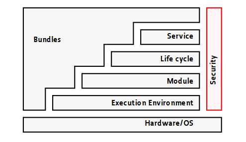

# OSGi (Open Services Gateway initiative)

Archietecture orientée composant.

OSGi suppose que les applications peuvent être considérées comme un ensemble de bundles

Composant = Services = Bundles

## Pourquoi OSGi ?

### Modularité

- Reutilisabilié
- Abstraction
- Séparation des préoccupations
- Maintenance facile

### Sans OSGi ? Limites de la modularité avec Java

1. Lorsque le package A a besoin du code de paquet C, les paquets B, D, E et F peuvent voir ce code.

2. Ne fournit pas une manière dynamique de gérer les versions et dépendances.

3. Au moment de l'exécution, le contenu de tous les fichiers JAR est traité comme une liste unique, ordonnée et globale appelée *classpath*. Si A requires B et C et A dépends d'une version de B et C d'une autre version de B: il pourrait avoir de conflits.

4. ...

### Avec OSGi

1. Encapsulation au niveau du package.

2. Déploiement dynamique d’applications sans interruption de la plateforme: chargement à chaud

3. Gestion des versions et de l'isolation des bundles : si A importe B et B importe C, A n'a pas accès au code dans C

4. ...

### Différence entre un Jar et un bundle

Un JAR et un Bundle diffèrent en ce sens qu'un Bundle n'est pas un application complète emballée, mais plutôt un
ensemble de classes très cohérents.

## Architecture en couches

Les fonctionnalités du framework sont divisées en couches:

*Source : osgi.core-5.0.0 official specifications documentation*

La couche Module peut être utilisée sans la couche life cycle et Service Layer.

### Security Layer

Gestion des aspects de sécurité

### Module Layer

Dans le contexte d'OSGi, un bundle est une unité logicielle autonome qui peut être chargée et déchargée dynamiquement. Les bundles peuvent utiliser des classes les uns des autres, mais cette utilisation est contrôlée par des contraintes.

Cette couche définit comment un bundle doit être exporter et comment il peut importer des dépendances.

#### Contenu d'un bundle

Il s'agit d'un jar structuré comme suit:

- Un fichier MANIFEST.MF présent dans le répertoire META-INF
- Une classe *Activator* exécutée au moment de l'activation ou de la désactivation du composant

#### MANIFEST.MF

Export-Package

Declare which packages are visible to other bundles in
essence adding an additional access modifier to Java

Import-Package

Declare which “exported-package(s)” the bundle depends on
for functionality.

Require-Bundle

Include an entire Bundle as a dependency (legacy).

#### Activator Interface

### Life Cycle Layer

Gère le cycle de vie des bundles à partir d'un *repository* de manière dynamique (sans nécessiter que la JVM soit redémarrée)

### Service Registry Layer 

Fournit un modèle de service *publier/trouver/lier* pour découpler les bundles. Permet de gérer la communication entre les bundles

## Implémentations populaires

- [Eclipse Equinox](https://projects.eclipse.org/projects/eclipse.equinox){:target="_blank"}
- [Apache Felix](https://felix.apache.org/documentation/index.html){:target="_blank"}
- ...

## Liens utiles

- 📄 [Spécifications API OSGi](https://docs.osgi.org/download/r5/osgi.core-5.0.0.pdf){:target="_blank"}

- 📄 [Introduction au OSGi](https://wso2.com/files/introduction_to_osgi.pdf){:target="_blank"}

- :fontawesome-brands-youtube:{ .youtube } [OSGI Explained](https://www.youtube.com/watch?v=JVwQ47wAuE4&list=PLoEwRQcZHDV51OgIWkDxv-T4PXi1zmYiV){:target="_blank"}

- 📄 [Introduction au développement par composants](https://www.lirmm.fr/~tibermacin/ens/hmin304/cours/cours3.pdf){:target="_blank"}

- 📄 [Embedding the Felix Framework in my host application](https://felix.apache.org/documentation/subprojects/apache-felix-framework/apache-felix-framework-launching-and-embedding.html#_embedding_the_felix_framework){:target="_blank"}

- 📄 [Install OSGi with IntelliJ](https://github.com/culyssander/Hello-OSGi-with-IntelliJ/tree/master){:target="_blank"}
- 📄 [Maven Bundle Plugin commands](https://felix.apache.org/documentation/_attachments/components/bundle-plugin/){:target="_blank"}

