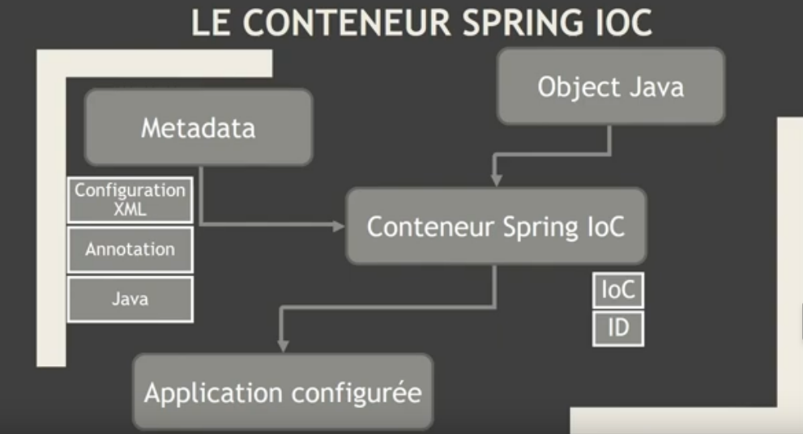
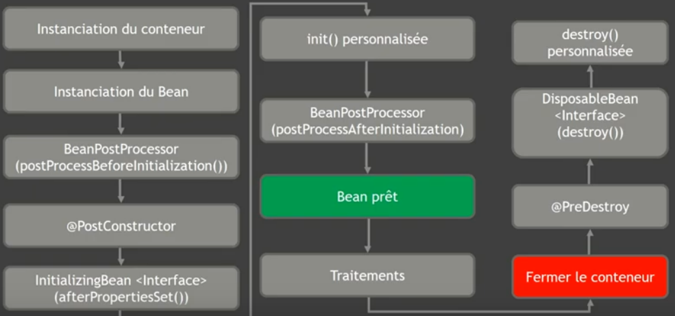

## Introduction

IoC (Inversion de dépendance) - Injection de dépendance - MVC - AOP

:fontawesome-brands-youtube:{ .youtube } [Mooc JAVA EE SPRING](https://www.youtube.com/watch?v=dFaw8NGx6kk){:target="_blank"}

### Inversion de dépendance

L'inversion de dépendance fait partie des principes SOLID. Voir tous les principes SOLID en cliquant [ici](../../ialtem/solid.md#dependency-inversion-principle-enonce-par-robert-c-martin).

### Injection de dépendance

#### Stratégie d'injection

Il y a trois manières d'injecter une dépendance:

- Par les attributs du classe *(moins préférée)* : Spring peut utiliser la réflexion pour moifier les propriétés privées non finales.
- Par les setters *(sujet à quelques débats)*
- Par le constructeur de la classe *(à préferer)*

#### Classe concrète ou interface

L'injection de dépendance peut être fait en utilisant une classe concrète ou une interface *(à préférer)*.

#### Bonnes pratiques avec l'injection de dépendance

- Privilégiez l'utilisation de l'injection par constructeur plutôt que de l'injection par setter;
- Marquez les propriétés (public ou private) comme *final* pour les composants injectés et initialisez les dans le constructeur;
- Chaque fois que cela est possible, utilisez une interface

### MVC

[En savoir plus](../../ialtem/styles.md#mvc-model-view-controller)

### AOP

[En savoir plus](../../frameworks/aop/index.md)

## Spring IoC et Spring Context

*(Source youtube chanel: AzerCode, Learn to code)*

- :fontawesome-brands-youtube:{ .youtube } [Architecture du Conteneur IoC](https://www.youtube.com/watch?v=Uh89d5OksJY&list=PL_X1gNh4UdGaSMThtkzjuC9cXntbh3ytY){:target="_blank"}
- 📄 [Spring Context](https://gayerie.dev/epsi-b3-orm/spring_framework/application_context.html){:target="_blank"}

### Beans

#### Java Bean vs POJO vs Spring Bean

- :fontawesome-brands-youtube:{ .youtube } [Voir la différence entre ces notions...](https://www.youtube.com/watch?v=lQ3svlKjs70&t=5m5s){:target="_blank"}

#### Les types de portée

- Singleton (default): Une seule instance du bean est créée dans le conteneur IoC. Cela signifie qu'il n'y a qu'une seule instance de ce bean dans toute l'application.

- Prototype: Une nouvelle instance du bean est créée chaque fois qu'il est demandé. Cela signifie que chaque fois que vous récupérez le bean, vous obtenez une nouvelle instance distincte.

- Request: Une seule instance du bean est créée par requête HTTP. Cela signifie qu'une nouvelle instance du bean est créée pour chaque requête HTTP qui est reçue par l'application.

- Session: Une seule instance du bean est créée par session HTTP. Cela signifie qu'une nouvelle instance du bean est créée pour chaque session HTTP active dans l'application.

- Global-Session: Une seule instance du bean est créée par session globale. Les sessions globales ne sont généralement utilisées que dans un contexte de portlet.

- Application: Le bean est lié au cycle de vie d'un contexte Servlet. Cela signifie que le bean est créé lorsque le contexte Servlet est initialisé et détruit lorsque le contexte Servlet est détruit.

- Websocket: lie une seule définition de bean au cycle de vie d'un WebSocket. Cela signifie que le bean est créé lorsque le WebSocket est créé et détruit lorsque le WebSocket est fermé.

- Custom Scope:  Les portées Spring sont extensibles et vous pouvez définir votre propre portée en implémentant l'interface "Scope" de Spring.

Pour plus de détails, consultez la documentation Java de Spring. Vous ne pouvez pas remplacer les portées Singleton et Prototype intégrées.

#### Cycle de vie des beans

*(Source youtube chanel: AzerCode, Learn to code)*

Toutes les vidéos de la playlist vous permettront de comprendre en détails le cycle de vie d'un bean.

:fontawesome-brands-youtube:{ .youtube } [Beans Lifecycle](https://www.youtube.com/watch?v=HXawRUa7ZK4&list=PL_X1gNh4UdGbRHjx--KG5HXX6Dtf4U6O4&index=1){:target="_blank"} 

## Autres ressources

- 📄 [IoC Principe et implémentation](https://gayerie.dev/epsi-b3-orm/spring_framework/principe_ioc.html){:target="_blank"}
- 📄 [IoC and dependency injection principle](https://www.martinfowler.com/articles/injection.html){:target="_blank"}