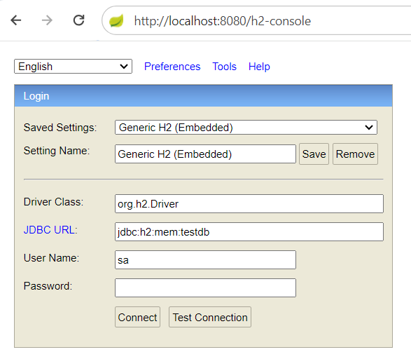

## H2

H2 est une base de données relationnelle open source écrite en Java. Elle est légère, rapide et portable, ce qui la rend idéale pour le développement et les tests d'applications.

H2 est une base de données embarquée, ce qui signifie qu'elle peut être intégrée à une application Java sans avoir besoin d'un serveur de base de données distinct. Elle est également auto-hébergée, ce qui signifie qu'elle ne nécessite pas de logiciel tiers pour fonctionner.

**Les étapes de configurations:**

1. Ajouter la dépendance au fichier *pom.xml*
``` xml
<dependencies>
    <dependency>
        <groupId>com.h2database</groupId>
        <artifactId>h2</artifactId>
        <scope>runtime</scope>
    </dependency>
</dependencies>
```
2. Ajouter cette configuration dans *application.properties*


3. Accédez à la base au niveau de l'interface




## MariaDB

## MongoDB

## PostgreSQL
