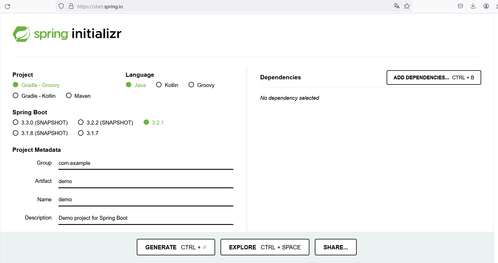
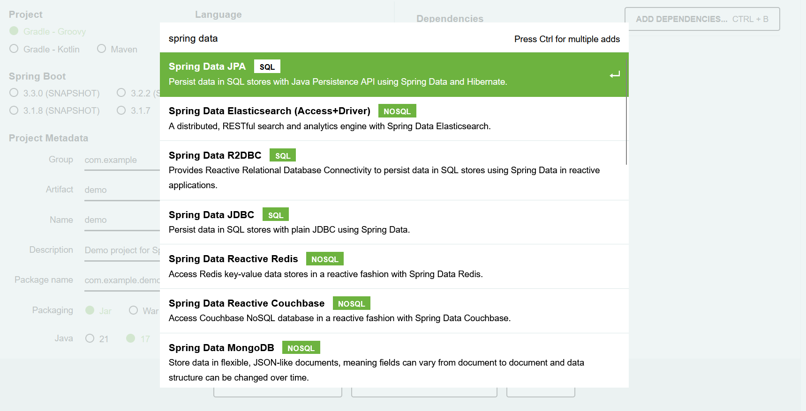
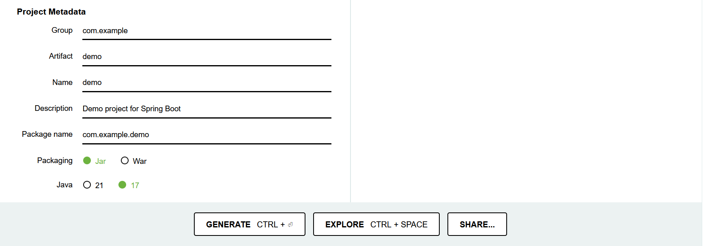

Spring Boot est une extension de Spring qui simplifie le développement d'applications Spring. Spring Boot fournit une configuration par défaut pour de nombreuses fonctionnalités Spring, ce qui permet aux développeurs de se concentrer sur le développement de leur application plutôt que sur la configuration de Spring.

📄 [Site officiel](https://start.spring.io/){:target="_blank"}

**Page d'acceuil de Spring Boot**

**Ajout des dépendances**

**Configurations finales**

