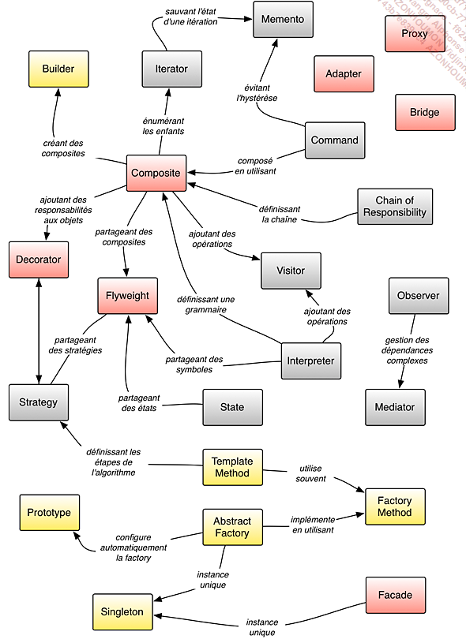

# Introduction

## Visual Studio

## Les patterns de création

### Singleton

Ce pattern résoud le problème de ...

**Diagramme de classe**

**Diagramme de séquence**

**Ressources**

- lien vers le code source github
- lien vers la capsule du prof
- fichier du diagramme de classe à importer et exploiter dans visual

## Les patterns de structuration

## Les pattens de comportement

## Synthèse et relation entre les patterns

