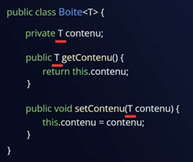
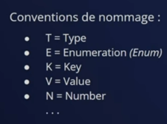

## Classes abstraites vs Interfaces
:fontawesome-brands-youtube:{ .youtube } [Classes abstraites et interfaces](https://www.youtube.com/watch?v=3uozXdhQTEA&list=PLzzeuFUy_CniTo0Pm8Tdh7MVVYhF32fdx){:target="_blank"}

## Encapsulation, Héritage et polymorphisme

:fontawesome-brands-youtube:{ .youtube } [Encapsulation, Héritage et Polymorphisme en programmation objet](https://www.youtube.com/watch?v=PIbSz87K7Qw&list=PLzzeuFUy_CnjZpKCGfQ9HpJFxkqGeGFO0){:target="_blank"}

## Généricité

{ width="40%" } { width="45%" }

:fontawesome-brands-youtube:{ .youtube } [Multi Data Type](https://www.youtube.com/watch?v=FXSPbswah2o){:target="_blank"}

## Réflexivité

- :fontawesome-brands-youtube:{ .youtube } [Java reflection](https://www.youtube.com/watch?v=twa3RfwtMyk&list=PLzzeuFUy_CngBllF3pwwnB0sQppKenSuG){:target="_blank"}

- 📄 [https://www.baeldung.com/java-reflection](https://www.baeldung.com/java-reflection){:target="_blank"}

- 📄 [https://docs.oracle.com/en/java/javase/17/docs/api/java.base/java/lang/Class.html](https://docs.oracle.com/en/java/javase/17/docs/api/java.base/java/lang/Class.html){:target="_blank"}

## Métaclasse d'une classe

Les métaclasses nous permettent de décrire le processus de création d’une classe de manière dynamique. Nous pouvons aussi altérer l’environnement d’une classe (ses champs, ses méthodes, ses superclasses…) lors de sa création de la classe et même après son initialisation.

- :fontawesome-brands-youtube:{ .youtube } [Métaclasse concepts](https://www.youtube.com/watch?v=5JqKDW8OZP8){:target="_blank"}

- :fontawesome-brands-youtube:{ .youtube } [Métaclasse par l'exemple en python](https://www.youtube.com/watch?v=NAQEj-c2CI8){:target="_blank"}

