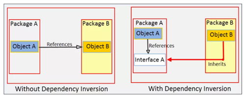

Les principes SOLID sont:

## :fontawesome-brands-youtube:{ .youtube } [**S**ingle Responsibility Principle *(Formulé par Robert C. Martin)*](https://www.youtube.com/watch?v=rjSw45LgysA&list=PLzzeuFUy_CngSfFq9-TJ0r8NC7Y3hSNpe&index=10){:target="_blank"}

**Une classe ne doit avoir qu'une seule raison de changer, c'est-à-dire qu'elle ne doit avoir qu'une seule responsabilité**

Voici quelques points clés du SRP :

1.	*Une seule responsabilité :* Une classe ne doit avoir qu'une seule raison de changer. Cela signifie que la classe doit être conçue pour accomplir une tâche bien définie, et cette tâche doit être sa seule responsabilité.

2.	*Séparation des préoccupations :* Le SRP encourage la séparation des préoccupations (separation of concerns) en veillant à ce que chaque classe gère uniquement un aspect spécifique de la logique de l'application.

3.	*Facilité de maintenance :* En suivant le SRP, lorsque vous apportez des modifications à une partie de la logique, vous ne devriez pas avoir à toucher d'autres parties du code qui ne sont pas directement liées. Cela facilite la maintenance du code.

4.	*Testabilité :* Les classes avec une seule responsabilité sont plus faciles à tester, car vous pouvez vous concentrer sur les tests de cette responsabilité spécifique sans être perturbé par d'autres parties du code.

## :fontawesome-brands-youtube:{ .youtube } [**O**pen/Close Principle *(formulé par Bertrand Meyer)*](https://www.youtube.com/watch?v=Uv15ZRFkUO0&t=1m02s){:target="_blank"}

**Une classe doit être ouverte à l'extension mais fermée à la modification**. Entre d'autres termes: le comportement d'une classe doit pouvoir être étendu sans que son code source soit modifié.

Explications:

1.	👍*Ouvert à l'extension* : Cela signifie que vous devez pouvoir ajouter de nouvelles fonctionnalités ou comportements à une classe sans avoir à modifier son code source existant. Vous étendez la classe en créant de nouvelles sous-classes ou en implémentant de nouvelles interfaces.

2.	👎*Fermé à la modification* : Une fois qu'une classe est bien conçue et fonctionne correctement, son code source ne doit pas être modifié. Vous ne devez pas apporter de modifications à la classe existante pour ajouter de nouvelles fonctionnalités.

Comment le faire ? 🙄

En pratique, cela signifie que lorsque vous prévoyez de modifier le comportement d'une classe, vous ne devriez pas modifier directement cette classe. Au lieu de cela, créez de nouvelles classes qui étendent ou implémentent des interfaces pour introduire de nouvelles fonctionnalités. Ce concept est au cœur du développement logiciel orienté objet, où l'héritage et la réutilisation du code sont des pratiques fondamentales.

- Utilisation de l'héritage ou de l'interface : Pour respecter le OCP, vous pouvez généralement utiliser l'héritage (création de sous-classes) ou l'implémentation d'interfaces pour ajouter de nouvelles fonctionnalités à une classe existante. Cela permet d'étendre le comportement de la classe sans toucher à son code source.

- Abstraction : Le OCP est souvent atteint en utilisant des abstractions (classes abstraites, interfaces) pour définir des contrats clairs qui peuvent être étendus par de nouvelles classes sans toucher aux classes existantes.

## :fontawesome-brands-youtube:{ .youtube } [**L**iskov Substitution *(proposé par Barbara Liskov)*](https://www.youtube.com/watch?v=Jj3ilspEj7o&t=1m30s){:target="_blank"}

**Les objets d'une sous-classe doivent pouvoir être substitués aux objets de la classe de base sans affecter la cohérence du programme.**

Conséquences:

- Si une classe B est une sous-classe (ou classe dérivée) d'une classe A, alors toute instance de B doit pouvoir être utilisée là où une instance de A est attendue, sans causer de problèmes. Cela signifie que les sous-classes ne doivent pas modifier ou violer le contrat établi par la classe de base.

- Le respect du LSP garantit que le polymorphisme fonctionne correctement et que les classes dérivées ne modifient pas le comportement attendu hérité de la classe de base

## :fontawesome-brands-youtube:{ .youtube } [**I**nterface segregation principle *(Formulé par Robert C. Martin)*](https://www.youtube.com/watch?v=Yx_dRbPoAxM&list=PLzzeuFUy_CngSfFq9-TJ0r8NC7Y3hSNpe&index=41){:target="_blank"}

**Les clients ne doivent pas être forcés de dépendre d'interfaces qu'ils n'utilisent pas**

Conséquences:

- Une classe qui implémente une interface ne devrait pas être obligée de fournir des implémentations pour toutes les méthodes de cette interface, surtout si ces implémentations ne sont pas pertinentes pour cette classe.

- Le principe de ségrégation des interfaces se concentre sur la conception des interfaces et vise à éviter des interfaces trop volumineuses et complexes. L'ISP encourage la création d'interfaces spécifiques à un contexte ou à un client particulier, au lieu de créer une seule interface volumineuse qui couvre de nombreuses méthodes

## :fontawesome-brands-youtube:{ .youtube } [**D**ependency inversion principle *(énoncé par Robert C. Martin)*](https://www.youtube.com/watch?v=fhzrr3uaxZY&list=PLzzeuFUy_CngSfFq9-TJ0r8NC7Y3hSNpe&index=12){:target="_blank"}

**1. Les modules de haut niveau ne doivent pas dépendre des modules de bas niveau. Les deux doivent dépendre de l'abstraction.**

**2. Les abstractions ne doivent pas dépendre des détails. Les détails doivent dépendre des abstractions.**

- :fontawesome-brands-youtube:{ .youtube }[ Précautions pour appliquer l'inversion de dépendance](https://www.youtube.com/watch?v=waDkwJ_tDHs&list=PLzzeuFUy_CngSfFq9-TJ0r8NC7Y3hSNpe&index=13){:target="_blank"}

- :fontawesome-brands-youtube:{ .youtube }[ Implémentation du principe d'inversion de dépendance](https://www.youtube.com/watch?v=Oi5ns_iOh8k&list=PLzzeuFUy_CngSfFq9-TJ0r8NC7Y3hSNpe&index=14){:target="_blank"}

Le DIP favorise l'utilisation de l'injection de dépendances, de l'inversion de contrôle (IoC) et du conteneur d'injection de dépendances pour gérer les dépendances entre les composants. Cela rend le code plus flexible, modulaire et facilite le remplacement des composants.