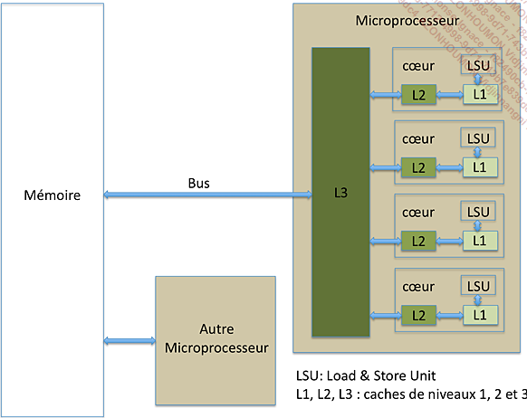
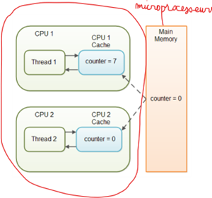

# Programmation concurrente: Mieux utiliser le processeur 😉

## Contexte

### Environnement monoprocesseur

**Monoprocesseur = 1 coeur physique**

**Un processus = un programme en cours d'exécution**

- Chaque processus s'exécute de manière isolée (pas de partage de contexte ou de mémoire entre les processus). Autres mécanismes de communications comme les signaux, les tuyaux, les zones partagées ...

- Le processeur exécute un processus à la fois.

Les environnements monoprocesseur datent des premiers ordinateurs.

- En attribuant des priorités différentes *(haute et basse)* aux processus qui partagent un même processeur, le système d'exploitation donne l'impression que ces processus s'exécutent en parallèle, même si ce n'est pas le cas.

- 1 processeur physique peut avoir des <span class="span-hightlight">processeurs logiques</span> ou coeurs logiques. Ils lui permettant de faire du traitement parallèle qui dans une certaine mesure est limité.

Le besoin de calcul intense et la limite matériel du  **silicium (Si)** ont mené à l'option des multiprocesseurs pour accroître la puissance d'une machine.

#### Et si on faisait un peu d'histoire 😎

!!! info
    .... Un autre facteur important qui influe directement sur la puissance de calcul des microprocesseurs est la vitesse de calcul. Les premiers microprocesseurs fonctionnaient avec une fréquence de travail de l’ordre de quelques centaines de milliers de cycles par seconde. La vitesse de calcul des instructions est un multiple du nombre de cycles par seconde. Aujourd’hui, la fréquence de travail des microprocesseurs est de l’ordre des 4 GHz (4 milliards de cycles par seconde). Dépasser cette fréquence semble difficile, l’augmentation de la fréquence des microprocesseurs stagne depuis plus années. La raison est simple, elle est à chercher du côté de la matière première utilisée pour fabriquer les composants : le silicium. Le silicium est un semi-conducteur facile à se procurer, il est le troisième élément le plus abondant sur terre. Les caractéristiques du silicium font qu’il est difficile de franchir les fréquences, contrairement à d’autres semi-conducteurs tels que l’arséniure de Gallium. Cependant, ils sont plus difficiles à concevoir et l’approvisionnement en matière première est plus compliqué que le silicium. C’est pour cette raison que l’industrie continue à utiliser le silicium comme semi-conducteur de base avec les inconvénients inhérents à cet élément chimique. De plus, dans le cas du silicium, les pertes énergétiques commencent à ne plus être linéaires lorsque la fréquence de travail dépasse 1 GHz. Par conséquent, l’accroissement de la fréquence engendre des pertes énergétiques liées plus au silicium qu’au traitement de l’information.

    {:width="30%" align=left}
    Pour rappel, un microprocesseur ne consomme de l’énergie que lorsqu’il traite de l’information, cette consommation étant provoquée par les changements d’état des transistors dans le microprocesseur. Un microprocesseur qui ne traite pas d’information ne consomme pas (ou très peu). Un autre facteur qui a permis l’augmentation de la puissance de calcul est la diminution de la tension électrique de travail. Pour limiter les temps de commutation des transistors d’un état vers son opposé, les microprocesseurs ne reconnaissent que deux états (d’où la logique binaire). La tension est passée de 5 V à environ 1 V. Descendre en dessous du volt est difficile, les caractéristiques des transistors rendent difficile d’avoir des états bien définis nécessaires à la logique binaire.
    <br>
    Au final, la conclusion est simple. Les limites en termes de densité, de fréquence de travail et de tension d’alimentation sont proches d’être atteintes.
    <br>
    L'industrie a trouvé une parade simple à ces problèmes, tout du moins à court terme. L’idée est de multiplier les unités de traitement. L’intérêt immédiat est de résoudre le problème de la limite en fréquence. Schématiquement, du point de vue de la consommation en énergie, il est préférable d’avoir 2 processeurs fonctionnant à 2 GHz plutôt qu’un seul fonctionnant à 4 GHz. La puissance de calcul effective est la même, mais la consommation en énergie inférieure pour la première configuration. C’est pour cette raison qu’à partir des années 2000, les microprocesseurs ont vu leur nombre de cœurs (ou unité de traitement) augmenter. Aujourd’hui, le nombre de cœurs avoisine 20 cœurs par processeur, il y en aura plus dans quelques années. Augmenter le nombre de cœurs dans un processeur a aussi une limite, qui est la bande passante entre la mémoire et le processeur. Tous les cœurs d’un microprocesseur partagent un même bus pour transférer les informations entre la mémoire et le microprocesseur.

    {:width="60%"}

    *(Source: Programmation concurrente (Maîtrisez le traitement de vos données en Java) - Laurent Joyeux - Collection Epsilon, 2017)*

    <br>
    Si tous les cœurs fonctionnent avec la même charge de travail, la bande passante par cœur est la bande passante totale divisée par le nombre de cœurs. Plus le nombre de cœurs est important, et plus les cœurs auront tendance à attendre les données. Pour contourner le problème, les microprocesseurs se voient dotés d’une mémoire cache unifiée aux différents cœurs. La mémoire cache s’intercale entre le microprocesseur et la mémoire principale. La mémoire cache réduit les échanges avec la mémoire principale en maintenant une petite partie des données de la mémoire principale dans le cache. Une synchronisation des données est faite entre le cache et la mémoire principale pour garder la cohérence des données. La mémoire cache a aussi le bon goût d’être beaucoup plus rapide que la mémoire principale. La mémoire cache limite les échanges entre le microprocesseur et la mémoire principale, dans le cas idéal, les échanges se feront principalement entre le cache et le microprocesseur.
    <br>
    Pour augmenter la bande passante entre le microprocesseur et la mémoire principale, une parade consiste à multiplier le nombre de bus entre le microprocesseur et la mémoire, c’est le cas pour les microprocesseurs récents.
    <br>
    L’avènement des [microprocesseurs multicœurs](https://fr.wikipedia.org/wiki/Microprocesseur_multi-c%C5%93ur){:target="_blank"} ne fait que résoudre partiellement le problème lié aux limites actuelles. Reste que l’exploitation d’une puissance de calcul répartie entre différents cœurs suppose d’écrire des logiciels pouvant tirer parti de ces microprocesseurs. C’est un des objets de la programmation concurrente. Être capable d’écrire un logiciel dans un environnement multiprocesseur. Les multiprocesseurs permettent d’avoir des environnements où différents programmes sont exécutés simultanément. Dans un environnement monocœur, les programmes seront, au mieux, exécutés l’un après l’autre de manière exclusive. Ce qui impose plus de rigueur d’écriture dans un environnement multicœur...

#### Synthèse

Le besoin d'accroître la performance du processeur et la limite matérielle dûe au silicium, ont conduit à l'augmentation des unités de traitement d'un microprocesseur.

**Conséquences:**

- Cache interne aux unités de traitements
- Mise à jour périodique du cache des coeurs avec la mémoire centrale. **Cette mise à jour est effectuée par l'OS et échappe au programmeur.**
- Partage du même bus pour transférer les informations entre la mémoire et le microprocesseur, induisant des temps de latence.

La plus grande implication est le besoin au niveau applicatif de forcer la synchronisation avec la mémoire centrale pour garder tous les threads informés de l'état des variables partagées.



**En java, cela passe par l'utilisation du mot clé [volatile](#volatile)**

### Environnement multiprocesseur (multi-coeur)

Le premier système multiprocesseur commercial, le CDC 6600, a été introduit en 1964

- Plusieurs processeurs physiques. 
- Plusieurs processus peuvent s'exécuter simultanément, chacun sur un processeur différent (Vrai parallélisme)

==> les serveurs, les supercalculateurs et les applications qui nécessitent des performances élevées


### Environnement monothreadé

**Un processus principal = 1 thread**

Si une application monothreadée tourne dans un environnement multiprocesseur, le système ne sera pas exploité à son plein potentiel. Comment régler ce problème...  *c'est possible avec les applications multithreadés*.


### Environnement multithreadé

**Un processus principal et plusieurs fourches**

**[Thread](https://en.wikipedia.org/wiki/Thread_(computing)){:target="_blank"} = fil d'exécution de code, à l'intérieur d'un processus, et qui a la possibilité d'être ordonnancé.**

- Un programme multithreadé profite des capacités multicoeurs du microprocesseur et du parallélisme des tâches.

- chacun thread dispose d'une pile et d'un pointeur de programme

**Attention:** Remarquez qu'une application multithreadée peut bien tourner dans un environnement monoprocesseur (*avec la présence de coeur logique*).


### Processus et Threads

Ce qu'il faut retenir: 

- Tout processus a un thread principal,
depuis lequel d’autres threads peuvent être lancés, dans le cas d'une application multi-thread.

- les threads partagent le même espace d'adressage que le processus qui les a lancés. Cela permet aux threads d'accéder aux mêmes données et aux mêmes ressources.


Maintenant que nous savions ce que c'est qu'un thread et un processus sans entrer dans les détails de leurs [cycles de vie](https://fr.wikipedia.org/wiki/Processus_(informatique)){:target="_blank"}, laissez moi vous présenter le Big Boss 😎 au niveau du système d'exploitation qui gère tous processus et leurs fils (threads). Le système d'exploitation peut utiliser différentes stratégies d'allocation des threads aux cœurs pour optimiser l'utilisation des ressources matérielles grâce au scheduler et nous verrons que cela peut poser quelques problèmes lors de l'exécution des programmes multithreadés.

### Le Scheduler

C'est le chef d'orchestre, un composant logiciel du système d'exploitation. C'est lui qui décide quel processus (ou thread) a accès à quelle ressources, quand, comment, pendant combien de temps. Il fait aussi pas mal d'autres choses...

**Ce qui nous intéresse :**

- le scheduler maintient une liste de processus et de threads à faire tourner;
- il décide - à une fréquence assez élevée - de leur donner la main à tour de rôle;
- simplement il faut bien réaliser qu'à ce stade, ce que manipule le scheduler, c'est essentiellement du code binaire, très proche du processeur, après toutes les phases de compilation et optimisation.

Pour y arriver il doit adopter une stratégie. C'est ce que nous appellons l'ordonnancement. Les deux grandes familles d'ordonnancement sont présentées ci-dessous.

### Les types d'ordonnancement

#### Ordonnancement collaboratif

- les tâches ne sont pas interruptibles: elles rendent la main lorsqu'elles ont fini ou lors de certains appels systèmes particuliers.

- Les tâches critiques sont protégées.

==> MsDos et Windows 3.1 utilisaient un ordonnancement collaboratif

==> Windows 95, 98 utilisaient un mode collaboratif pour certaines tâches.

🤓 Que se passe t'il lorsqu'une tâche entre dans une boucle infinie ou dure trop longtemps dans ce type d'ordonnancement ?

😲 je vous laisse deviner.

#### Ordonnancement préemptif

- Le système peut interrompre une tâche à tout moment *pour switcher à un autre thread*

- Le système n'est pas bloqué par certaines tâches trop longues

- Mais cela pose problème pour les tâches critiques qui ne doivent pas être interrompues.

==> Windows NT, XP et suivants, Unix, Linux, MacOs utilisent un ordonnancement préemptif

Vous auriez deviner, nos systèmes d'exploitations modernes utisent l'ordonnonancement préemptif. Cependant l'ordonnancement collaboratif est d'actualité dans certains contexte.

🤔 Et comment le scheduler opère le basculement entre tâches.

### Le context switches

*(Cette section est extrait du FUN Mooc: Les fondamentaux aux concepts avancés du language - Semaine 8)*

Très bonne question.

L'instant où le scheduler décide de suspendre l'exécution d'un processus - ou thread - pour donner la main à un autre, s'appelle un *context switch*; on parle de *process switch* lorsqu'on passe d'un processus à un autre, et de task switch ou *thread switch* lorsqu'on passe d'un thread à un autre à l'intérieur d'un processus.

Le point important pour nous, c'est que le scheduler est un morceau de code générique, il fait donc son travail de manière neutre pour tous les processus ou threads, indépendamment du langage par exemple, ou du domaine d'application; et que le découpage du temps en slots alloués aux différents joueurs se fait bien évidemment sur la base des instuctions élémentaires du processeur - ce qu'on appelle les *cycles*.

🥱 Tu veux en venir où avec toutes ces informations ?

**Phénomène général**

Le problème principal ici est lié à l'absence de contrôle, par le programmeur, sur les context switchings; et du coup ceux-ci peuvent intervenir à n'importe quel moment. Cela crée parfois de mauvaises surprises.

De manière générale :

- dans un langage de programmation un tout petit peu évolué, un fragment de code (même réduit à une instruction *i++; --i; ...*) se traduit presque toujours en plusieurs instructions binaires pour le processeur

- pour que le programme fonctionne correctement dans un mode multi-thread, certains fragments de code (*permutation, virement bancaire ...*), et notamment ceux qui accèdent à de la mémoire partagée, doivent être exécutés de façon atomique (c-à-d ne pas être interrompus en plein milieu par le scheduler)

- et sans aide du programmeur, le scheduler n'a aucun moyen de savoir où, dans le flot d'instruction binaires, il est légitime ou pas de faire un context switching.

**Solutions**

Pour rendre la programmation par thread utilisable en pratique, il faut lui adjoindre des mécanismes, accessibles au programmeur, pour rendre explicite ce type de problème.

La notion la plus simple de ces mécanismes est celle de *verrou* pour implémenter une *exclusion mutuelle*.

**En Java, cela passe par l'utilisation du mot clé synchronized.**. D'autres méchanismes existent comme les sémaphores que nous aborderons un peu plus loin.


### Résumé

Le besoin de faire de la programmation parallèle et d'exploiter les potentialités des nouvelles machines ont conduit à l'utilisation des threads. Cependant cela implique la gestion de la synchronisation des ressources et variables partagées (*avec des mécanismes de programmation: mots clés volatile et synchronized en java*) afin d'éviter les problèmes de: deadlock, race condition, starvation, dormancy ... Des pistes de résolutions de ces problèmes seront discutées un peu plus loin.

## Ressource et zone critique

### Ressource

Entité dont un thread ou un processus a besoin pour fonctionner

- ressource matérielle (périphériques, processeur)
- ressource logicielle (variables)

### Section critique

Partie d’un programme dont l’exécution de doit pas s’entrelacer avec d’autres programmes.

Une fois qu’une tâche y entre, il faut lui permettre de terminer cette section sans permettre àd’autres
tâches de travailler sur les mêmes données.

### Attentes passive et active

- **Attente active**: implémentée avec une <span class="span-hightlight">boucle</span>, le thread requête en boucle l'accès à la ressource jusqu'au son obtention. Cette attente est gourmande en CPU.

- **Attente passive**: le thread libère le CPU en attendant que la ressource ne soit disponible donnant ainsi la chance à d'autre thread de tenter leur chance. Implémenter grâce au mécanisme de <span class="span-hightlight">wait()</span>;

## Mécanisme classique de synchronization

### Volatile

**1. Utilité de volatile**: L'utilisation du mot clé volatile force l'écriture de la valeur d'une variable en mémoire ainsi que sa relecture. Si une variable n'est pas partagée entre plusieurs threads, il n'est pas nécessaire d'utiliser le mot-clé volatile.

**2. Garantie de lisibilité**: Le mot clé volatile ne réalise aucune opération pour garantir la gestion des accès concurrents : elle offre juste une garantie sur la visibilité.

**3. Utilisation**: Le mot clé volatile s'utilise sur la déclaration d'une variable. Il n'est pas possible de l'utiliser sur une méthode ou une classe. L’utilisation de volatile n’a de sens que sur les types basiques primaires *(boolean, byte, char, short, int, long, float et double)*. L'utilisation de volatile directement sur l'objet n'a pas toujours un effet aussi prévisible ou souhaitable. Cela est dû au fait que volatile garantit la visibilité des changements de la référence à l'objet, mais pas nécessairement des changements internes à l'objet lui-même. 

**5. Atomicité des instructions complexes**: Volatile ne garantit pas l'atomicité des opérations complexes.

**6. Accès concurrent lecture/écriture**: En accès concurrent à une variable volatile, une demande de lecture ne sera accordée qu'une fois l'opération d'écriture en cours terminée.

Pour des opérations atomiques sur des objets complexes, Java propose d'autres mécanismes tels que les verrous (synchronized) ou l'utilisation de classes du package <span class="span-hightlight">java.util.concurrent</span>. Ces mécanismes garantissent à la fois la visibilité des changements et l'atomicité des opérations complexes. 

Exemple d'utilisation de volatile:

``` java linenums="1" hl_lines="3 6 12"
public class Foo extends Thread{

    private volatile boolean close = false;

    public void run(){
        while(!close){
            // do work
        }
    }

    public void close(){
        close = true;
    }

}
```

### Synchronized

Le mot clé synchronized :

- contrôle les modifications de variables partagées au sein d'une zone critique. Cela assure qu' à chaque instant, un seul thread peut exécuter et modifier des variables dans zone critique les autres threads attendront leur tour.

- permet de demander l'acquisition d'un moniteur

**Les trois manières d'utiliser synchronized sont mis en évidence**

``` java linenums="1" hl_lines="7 14 23"
public class Bridge {

    private Object key =  new Object() ;

    // méthode statique synchronisée, le paramètre de synchronisation est 
    // l'objet Bridge.class
    public static synchronized boolean getCapacity() {
      
       // corps de la méthode
    }

    // méthode non statique synchronisée, le paramètre de synchronisation est
    // l'objet this
    public synchronized boolean enter() {
      
       // corps de la méthode
    } 
   
    public boolean getout() {
      
       // synchronization sur l'objet key
       // on peut aussi synchroniser sur l'objet this
       synchronized(key) {
      
          // bloc synchronisé
       }
    }
}
```

### Exemple de la classe singleton

``` java linenums="1" hl_lines="4 9"
public class Singleton {

    // volatile variable
    public static volatile Singleton _instance ;

    public  getInstance() {
        if(_instance == null){
            synchronized(Singleton.class){
                if(_instance == null){
                    _instance = new Singleton();
                }
            }
        }
      
       return _instance;
    }
}
```

- Le *mot-clé volatile est appliqué à la référence de l'instance unique du Singleton*, et non directement à l'objet complexe lui-même. C'est cette référence qui doit être garantie comme visible entre les threads. 

- Cette approche, appelée <span class="span-hightlight">Double-Checked Locking with Volatile</span>, vise à optimiser les performances en évitant le coût du verrouillage à chaque appel de la méthode getInstance, tout en garantissant une initialisation sûre dans un environnement multithreadé grâce à l'utilisation de volatile. 


## Stratégies avancées de synchronisation

Les mutex et les sémaphores sont des mécanismes de synchronisation utilisés dans la programmation concurrente pour assurer un accès sécurisé aux ressources partagées entre plusieurs threads.

### Mutex

Un mutex (mutual exclusion) signifie que l'accès à la ressource est mutuellement exclusif pour les threads.

#### Exemple en Java

```java linenums="1" hl_lines="7 11"
public class ExempleMutex {

    // Le verrou ou mutex
    private final Lock mutex = new ReentrantLock();

    public void methodeCritique(){
        mutex.lock(); // P(mutex) : entrée en section critique
        try{
            // Section critique : accès sécurisé à la ressource partagée
        } finally{
            mutex.unlock(); // V(mutex): sortie de la section critique
        }
    }
}
```

Pour le mutex, le compteur est 1.

- l'opération **P** (*proberen*, signifiant "essayer" en néerlandais) décrémente le compteur;
- l'oparation **V** (*verhogen*, signifiant "augmenter" en néerlandais) l'incrémente

#### Pseudo implémentation idéale d'un mutex

```linenums="1" hl_lines="4 11 15 17"
int libre = 1;
fifo liste_attente;

lock(){  // synchronized
    while(1){
        if(libre){
            libre = 0;
            return;
        }
        liste_attente.ajouter(thread_courant());
        wait(); // Met en attente le thread courant
    }
}

unlock(){ // synchronized
    if(liste_attente.non_vide()){
        signal(liste_attente.retirer())
    }else{
        libre = 1;
    }
}
```

### Sémaphore

Un sémaphore est un mécanisme plus général que le mutex et peut être utilisé pour contrôler l'accès à un nombre fixe de ressources simultanément.

Pour contrôler l'accès à un fichier, un sémaphore peut être utilisé pour compter le nombre de threads qui accèdent au fichier. Lorsque le nombre de threads atteint un certain seuil, le sémaphore peut être utilisé pour bloquer les nouveaux threads qui tentent d'accéder au fichier.

```java linenums="1" hl_lines="7 11"
public class File {

    // Sémaphore initialisé avec un compteur de 3
    private final Semaphore sem = new Semaphore(3); // limite à 3 jetons

    public void open(){
        sem.acquire(); // P opération
        try{
            // Section critique : accès sécurisé à la ressource partagée
        } finally{
            sem.release(); // V opération
        }
    }
}
```

Dans cet exemple, le sémaphore est initialisé avec une limite de 3. Trois threads peuvent acquérir le sémaphore simultanément, mais les suivants doivent attendre qu'au moins un thread libère le sémaphore en exécutant l'opération release.

### Mutex - Moniteur - Semaphore

📄 [Différence entre Mutex - Moniteur - Semaphore](https://codegym.cc/fr/groups/posts/fr.220.difference-entre-un-mutex-un-moniteur-et-un-semaphore){:target="_blank"}

## Problèmes (Liveness)

### Deadlock ❌

Un deadlock est une situation dans laquelle deux ou plusieurs threads sont bloqués l'un l'autre, empêchant chacun de terminer son exécution. Cela se produit lorsque chaque thread détient une ressource dont l'autre thread a besoin pour continuer à s'exécuter.

!!! tip "Préventions"
    Voici quelques conseils pour prévenir les deadlocks :

    - **Utilisez des mécanismes de synchronisation appropriés**. Les mécanismes de synchronisation comme les mutex et les sémaphores peuvent être utilisés pour contrôler l'accès aux ressources partagées. Il est important d'utiliser le mécanisme de synchronisation approprié pour la situation.
    - **Évitez les verrous circulaires**. Un verrou circulaire se produit lorsqu'un thread détient un verrou sur une ressource qui est détenue par un autre thread qui détient un verrou sur la première ressource. Les verrous circulaires peuvent entraîner des deadlocks.
    - **Planifiez les threads de manière efficace**. Le système d'exploitation peut décider de mettre un thread en veille si d'autres threads sont plus prioritaires. Pour éviter cela, planifiez les threads de manière à ce que les threads les plus importants soient exécutés en premier.

### Race condition ❌

Une race condition est une condition dans un programme multithread où le résultat de l'exécution du programme dépend de l'ordre dans lequel les threads s'exécutent. Les race conditions peuvent entraîner des erreurs, des données corrompues ou un comportement inattendu.

Une race condition peut se produire lorsqu'un ou plusieurs threads accèdent à la même variable ou ressource partagée. Si les threads accèdent à la variable ou à la ressource en même temps, le résultat de l'exécution du programme peut être différent de celui qui serait obtenu si les threads s'exécutaient séquentiellement.

Voici quelques exemples de race conditions :

- Deux threads qui tentent d'écrire la même valeur dans une variable partagée.
- Deux threads qui tentent de lire la même variable partagée sans utiliser de mécanisme de synchronisation.
- Deux threads qui tentent de supprimer un élément d'une liste partagée.

Les race conditions peuvent être difficiles à diagnostiquer et à déboguer. Il est important de comprendre les causes des race conditions et les mesures à prendre pour les prévenir.

!!! tip "Préventions"
    - Utilisez des variables ou des ressources partagées de manière exclusive.

### Starvation ❌

Un thread est incapable d'accéder à des ressources partagées pendant une période prolongée, ce qui empêche le thread de s'exécuter et de terminer ses tâches. Cela peut se produire lorsqu'un thread a une priorité plus faible que les autres threads ou lorsque d'autres threads utilisent constamment les ressources partagées.

Voici quelques exemples de conditions qui peuvent entraîner de la starvation :

- Un thread avec une priorité faible a constamment accès à des ressources partagées.
- Plusieurs threads accèdent constamment à la même ressource partagée, empêchant d'autres threads d'y accéder.
- Un thread utilise une boucle infinie pour accéder à une ressource partagée, empêchant d'autres threads d'y accéder. (*Attente active*)

!!! tip "Préventions"
    - Utilisez des politiques de planification qui accordent des ressources aux threads en fonction de leur priorité.
    - Utilisez des mécanismes de synchronisation (mutex, semaphores) pour empêcher les threads d'accéder aux ressources partagées lorsqu'elles ne sont pas disponibles.
    - Évitez d'utiliser des boucles infinies pour accéder aux ressources partagées.

### Dormancy ❌

Un thread dormant est un thread qui a été placé dans un état d'attente par le système d'exploitation. Cela signifie que le thread n'exécute pas de code actuellement, mais attend toujours qu'un événement spécifique se produise avant de pouvoir reprendre l'exécution. Trop de dormance est un problème

!!! info "Les raisons de la dormance"
    Il existe plusieurs raisons pour lesquelles un thread peut être placé dans un état dormant :

    - **En attente de la fin d'une opération d'E/S** : Lorsqu'un thread émet une demande d'E/S, telle que la lecture d'un fichier ou d'une prise de socket réseau, le thread est généralement placé dans un état dormant jusqu'à ce que l'opération d'E/S soit terminée. C'est parce que le thread ne peut pas continuer à s'exécuter tant que les données demandées ne sont pas disponibles.

    - **En attente d'un événement de synchronisation** : Les threads peuvent également être placés dans un état dormant pour attendre un événement de synchronisation, tel qu'un sémaphore ou un mutex pour devenir disponible. Cela est utilisé pour contrôler l'accès aux ressources partagées et garantir qu'un nombre multiple de threads n'accède pas à la même ressource en même temps.

    - **En attente de la survenue d'une condition spécifique** : Les threads peuvent également être placés dans un état dormant pour attendre la survenue d'une condition spécifique. Cela est souvent utilisé pour implémenter des délais d'expiration ou d'autres formes d'exécution conditionnelle.

!!! tip "Préventions"
    - Définir un délai de **l'attente passive** en précisant en java le temps d'attente du thread au bout lequel il se réveillera sans aucun événement externe

    ```java
    wait(3000); // Environ 3s
    ```

    - S'assurez que le thread ne restera pas endormi un *wait()* doit être suivi d'un *notify()* ou d'un *notifyAll()*

## Aller plus loin ❌

### API java de gestion de la concurrence

### Programmation asynchrone

## Liens utiles

- 📄 [Spécification JAVA SE threads et locks](https://docs.oracle.com/javase/specs/jls/se8/html/jls-17.html#jls-17.4.1){:target="_blank"}

- 📄 [What is the volatile keyword useful for](https://stackoverflow.com/questions/106591/what-is-the-volatile-keyword-useful-for){:target="_blank"}

- 📄 Programmation concurrente (Maîtrisez le traitement de vos données en Java Java) - Laurent Joyeux - Collection Epsilon, 2017

- :fontawesome-brands-youtube:{ .youtube } Programmation concurrente - Multithreading et traitement d'informations en Java (ENI) de Thomas Broussard

- :fontawesome-brands-youtube:{ .youtube } [Problèmes de synchronisation](https://www.youtube.com/watch?v=l_dnpUkkaSg){:target="_blank"}

- :fontawesome-brands-youtube:{ .youtube } [Problème des lecteurs et rédacteurs](https://www.youtube.com/watch?v=B2xijT1ULHw){:target="_blank"} 

- :fontawesome-brands-youtube:{ .youtube } [Problème des philosophes](https://www.youtube.com/watch?v=Qmb3iGf9HJg){:target="_blank"} 

- :fontawesome-brands-youtube:{ .youtube } [Problème des producteurs et consommateurs](https://www.youtube.com/watch?v=SJDejntCGSM){:target="_blank"}

- 📄 [Problème de famine](https://fr.wikipedia.org/wiki/Famine_(informatique)){:target="_blank"}

- 📄 [Blog Paumard](https://blog.paumard.org/cours/java-api/chap05-concurrent-synchronisation.html){:target="_blank"}


- 📄 [Handout programmation concurrente](https://p-fb.net/licence3/prog_concurrente/cours/handout_programmation_concurrente_2022_2023.pdf){:target="_blank"}


